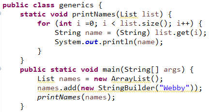
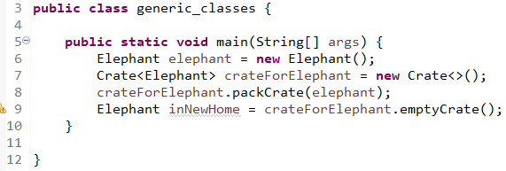
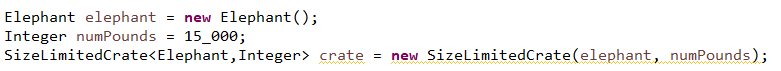
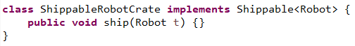
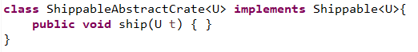
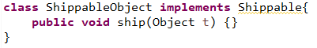
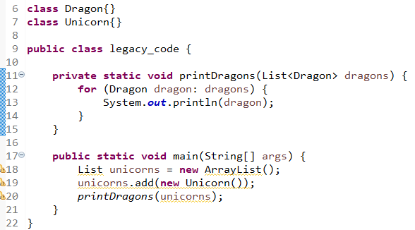
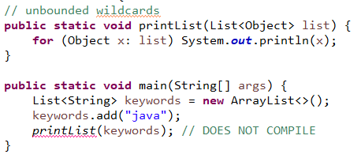
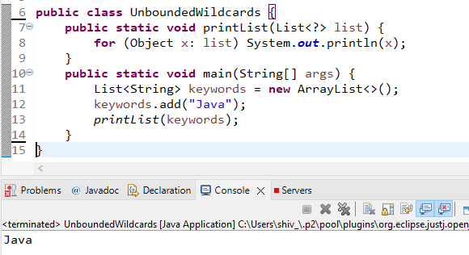
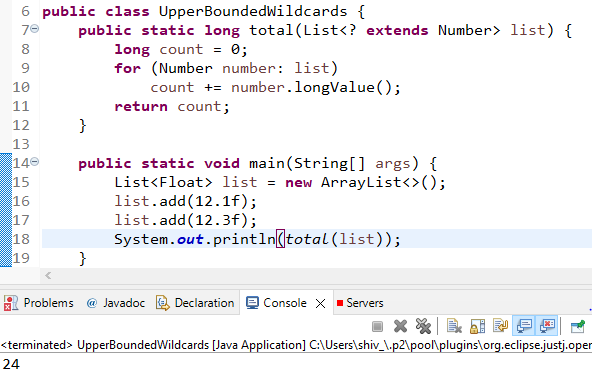

<link href="../../styles.css" rel="stylesheet"></link>

# 🟪 3.2 Working With Generics

Why do we need generics? We would need to expect the caller to not put something in the list we didn't expect.



Executing the above code throws a ClassCastException. We added a StringBuilder to the list which is legal as a List can contain anythiung. Then the StringBuilder is casted to a String which cannot happen.

Generics fix this issue by declaring the type of objects which can be put into the list.

```java
    List<String> names = new ArrayList<String>();
    names.add(new StringBuilder("Webby")); // DOES NOT COMPILE
```

<hr>

# 🟪 1 Generic Classes

We can introduce generics into classes. We can declare a formal type paremeter using angled brackets (<>)

For example, we create a Crate class with a generic parameter:

```java
class Crate<T> {
    private T contents;
    public T emptyCrate() {
        return contents;
    }
    public void packCrate(T contents) {
        this.contents = contents;
    }
}
```

The generic type T is available anywhere within the Crate class. When you instantiate the class, you tell the compiler what T should be.

## 🟦 Naming Conventions for Generics

The following are common letters to use:

- E for element
- K for a map key
- V for a map value
- N for a number
- T for a generic data type
- S, U, V and so forth for multiple generic types.

### 🟠 Example 🟠

Suppose an Elephant class exists:



We can see the Crate class is able to deal with the Elephant class without knowing its implementation.

Suppose we have another Zebra class:

```java
Crate<Zebra> crateForZebra = new Crate<>();
```

We could've create an Animal superclass or interface! But generics allow us to have a type parameter for classes with no relationships!

For example, we can have a Robot in our crate:


Before, we would've had to use an Object class. So the crate does not need to know about objects, the objects also don't need to know about crate! So we didn't need to create an interface like Crateable.

Generics may not come up in code we write, but it certainly does come up in code we call, like the Collections framework

## 🟦 Multiple Generic Types

Generic classes aren't limited to one generic type, here is a class with 2 generic parameters:

```java
class SizeLimitedCrate<T, U> {
    private T contents;
    private U sizeLimit;
    public SizeLimitedCrate(T contents, U sizeLimit) {
        this.contents = contents;
        this.sizeLimit = sizeLimit;
    }
}
```

- T is used for the type of contents
- U is the units for the to measure the size

Suppose we create a crate for elephants:



## 🟦 Type Erasure

When we use a generics, like when we replace T with Robot, the compiler replaces all references to T in Crate with Object. Hence generics are actually just Object types. The Crate class which is created looks like the following:

```java
public class Crate {
    private Object contents;
    public Object emptyCrate(){
        return contents;
    }
    public void packCrate(Object contents){
        this.contents = contents;
    }
}
```

This means there is only one class file! The process of removing generics is called **type erasure**

<hr>

# 🟪 2 Generic Interfaces

An interface can also declare a formal type parameter. E.g., the following interface uses a generic type as the argment to its ship method:

```java
interface Shippable<T>{
    void ship(T t);
}
```

There are 3 ways a class can approach implementing the interface:

1. Specify the generic type in the class. The following concretion:



2. Create a generic class. The caller is required to specify the generic type:



The typed parameter can be named anything.

3. Using an Object reference:



<br><hr>

# 🟪 3 Generic Methods

We can declare generics at method level. This is useful for static methods since they aren't part of an instance that can declare the type.

### 🟠 Example 🟠

	public static <T> Crate<T> ship(T t){
		System.out.println("Preparing " + t);
		return new Crate<T>();
	}

The parameter is generic type T, the return type is Crate&lt;T&gt;.
Before the return type is the formal type parameter &lt;T&gt;

We can have some interesting method declarations:

1. public static &lt;T> void sink(T t) { }

2. public static &lt;T> T identity(T t) { return t; }

3. public static T noGood(T t){ return t; } // DOES NOT COMPILE

The last declaration does not have formal type declaration, hence doesn't compile!

<br><hr>

# 🟪 4 Interacting with Legacy Code

Legacy is older code written in a different style. This section will refer to code to target Java 1.4 or lower which does not use generics.

**Raw collections** are collections writter without generics. 
Generics give us compile-time safety provided the code involved also uses generics!

It is easy to fall for a false sense of security! Looking at the following code, we can see there's no compilation issues:



However, running the code yields a **ClassCastException**. The main method calls printDragons() with a raw type. Due to type erasem Java attempts to cast a Unicorn to Dragon. As a result, Java will give warnings when using raw types.

<hr>

# 🟪 5 Bounds

So far, generics are treated as Objects and have no methods available! Bounded wildcards solve this by restricting what types can be used in that wildcard position.

A **bounded parameter type** is a generic type that specifies the bound for the generic.

A **wildcard generic type** is an unknown generic type represented with a ?

## Types of Bounds:

| Type of Bound               | Syntax         | Example                                                          |
|-----------------------------|----------------|------------------------------------------------------------------|
| Unbounded wildcard          | ?              | List&lt;?> l = new ArrayList&lt;String>();                             |
| Wildcard with an upperbound | ? extends type | List&lt;? extends Exception> l = new ArrayList&lt;RuntimeException>(); |
| Wildcard with a lower bound | ? super type   | List&lt;? super Exception> l = new ArrayList&lt;Object>();             |

## 🟦 Unbounded Wildcards

An unbounded wildcard represents any data type. ? means any type is acceptable.

Let's suppose we want to write a method that looks through a list of any type:



While String is a subclass of Object, we cannot assign `List<String>` to `List<Object>`

Imagine there was code written like:

```java
List<Integer> numbers = new ArrayList<>();
numbers.add(new Integer(42));
List<Object> objects = numbers; // DOES NOT COMPILE
objects.add("forty two");
System.out.println(numbers.get(1));
```

Line 4 promises that the list will be of integers. If line 6 DID compile, line 7 would break the promise so the compiler prevents this!

### 🟠 Storing the Wrong Objects - Arrays vs ArrayLists
We are unable to write ```List<Object> l = new ArrayList<String>(); ``` because Java protects us from runtime exceptions.

However, with arrays we CAN write the following:

```java
Integer[] numbers = { new Integer(42) };
Object[] objects = numbers;
objects[0] = "forty two"; // throws ArrayStoreException
```

Back to the problem at hand, we do not need to use List&lt;Object> in our method! We can use the unbounded wildcard:



Now printList takes a list of any type!

## 🟦 Upper-Bounded Wildcards

Suppose we wrote a method which adds up the total of a list of numbers. We've seen before that a generic type cannot be assigned to a subclass:

```java
ArrayList<Number> list = new ArrayList<Integer>(); // DOES NOT COMPILE
```

We can workaround this by using a wildcard:

```java
List<? extends Number> list = new ArrayList<Integer>();
```

This upper-bounded wildcards says any class which extends Number or Number itself can be userd as a formal parameter type:



When we work with upper bounds or unbounded wildcards. The list becomes logically immutable! 

```java
static class Sparrow extends Bird { }
static class Bird { }

public static void main(String[] args) {
List<? extends Bird> birds = new ArrayList<Bird>();
birds.add(new Sparrow()); // DOES NOT COMPILE
birds.add(new Bird()); // DOES NOT COMPILE
}
```

Java does not know what List&lt;? extends Bird> reall is! It could be List&lt;Bird> or List&lt;Sparrow>. Since both are possible, neither is allowed.

Here's an example with interfaces. We have one interface and two implementations:

```java
interface Flyer { void fly(); }
class HangGlider implements Flyer { public void fly() {} }
class Goose implements Flyer { public void fly() {} }
```

We can then have methods which accepts the interface:

```java
private void anyFlyer(List<Flyer> flyer) {}
```

And methods which use the upperbound:

    private void groupOfFlyers(List<? extends Flyer>) {}

List&lt;Goose> can only be passed to the latter method!

## 🟦 Lower-Bounded Wildcards

Let's write a method that adds a string "quack" to two lists:

    List<String> strings = new ArrayList<String>();
    strings.add("tweet");
    List<Object> objects = new ArrayList<Object>(strings);
    addSound(strings);
    addSound(objects);

We want to pass List&lt;String> and List&lt;Object> to the same method

The below table demonstrates why we need a lower bound and solutions which do *not* solve the problem.


<hr>

# 🟪 6 Putting It All Together

We shall see some example questions regarding generics. We shall use the following classes:

```java
    class A {}
    class B extends A {}
    class C extends B {}
```

### 🟠 Example 1 🟠

Does the following compile or not?

```java
    List<?> list1 = new ArrayList<A>();
    List<? extends A> list2 = new ArrayList<A>();
    List<? super A> list3 = new ArrayList<A>();
    List<? extends B> list4 = new ArrayList<A>(); // DOES NOT COMPILE
    List<? super B> list5 = new ArrayList<A>();
    List<?> list6  = new ArrayList<? extends A>();
```

Line 6 stores a list of instances of A in a variable with unbounded wildcard. This is fine!

Line 7 stores a list of instances of A in n upper bounded variable. So this can store ArrayList&lt;A>, ArrayList&lt;B> or ArrayList&lt;C>.

Line 8 is a lower-bounded variable meaning it can only store instances of lowest type A.

Line 9 is a list upper-bounded by class B. It cannot store classes which are of supertype of B! Hence does not compile!

Line 10 is a list lower bounded by B, so its fine storing instances of A!

Line 11 allows an unbounded wildcard but you need to know the type which it is storing!

### 🟠 Example 2 🟠

**Does the following method compile or not?**

```java
<T> T method1(List<? extends T> list){
    return list.get(0);
}
```

```method1()``` is a perfectly fine use of generics!

**Does the following method compile or not?**

```java
<T> <? extends T> method2(List<? extends T> list){
    return list.get(0);
}
```

This does not compile! The return type is not actuallya  type.

**Does the following method compile or not?**

```java
<B extends A> method3(List<B> list){
    return new B();
}
```

This does not compile!


**Does the following method compile or not?**

```java
void method4(List<? super B> list) { }
```

This is a fine use for generics"

**Does the following method compile or not?**

```java
<X> void method5(List<X super B> list){

}
```

This does not compile since X is not a wildcard! It should be a question mark!