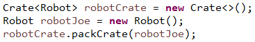
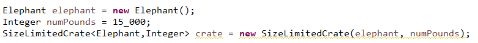
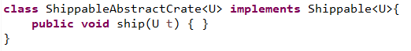
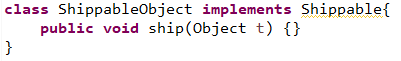
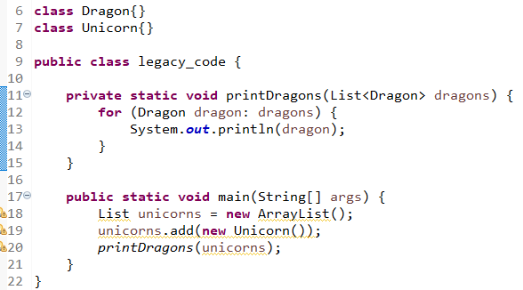

# 3.2 Working With Generics

Why do we need generics? We would need to expect the caller to not put something in the list we didn't expect.

Executing the above code throws a ClassCastException. We added a StringBuilder to the list which is legal as a List can contain anythiung. Then the StringBuilder is casted to a String which cannot happen.

Generics fix this issue by declaring the type of objects which can be put into the list.

    List<String> names = new ArrayList<String>();
    names.add(new StringBuilder("Webby")); // does not compile

# 1 Generic Classes

We can introduce generics into classes. We can declare a formal type paremeter using angled brackets (<>)

For example, we create a Crate class with a generic parameter:

    class Crate<T> {
        private T contents;
        public T emptyCrate() {
            return contents;
        }
        public void packCrate(T contents) {
            this.contents = contents;
        }
    }

The generic type T is available anywhere within the Crate class. When you instantiate the class, you tell the compiler what T should be.

## Naming Conventions for Generics

The following are common letters to use:

- E for element
- K for a map key
- V for a map value
- N for a number
- T for a generic data type
- S, U, V and so forth for multiple generic types.

## Example

Suppose an Elephant class exists:

We can see the Crate class is able to deal with the Elephant class without knowing its implementation.

Suppose we have another Zebra class:

    Crate<Zebra> crateForZebra = new Crate<>();

We could've create an Animal superclass or interface! But generics allow us to have a type parameter for classes with no relationships!

For example, we can have a Robot in our crate:

Before, we would've had to use an Object class. So the crate does not need to know about objects, the objects also don't need to know about crate! So we didn't need to create an interface like Crateable.

Generics may not cup up in code we write, but it certainly does come up in code we call, like the Collections framework

## Multiple Generic Types

Generic classes aren't limited to one generic type, here is a class with 2 generic parameters:

    class SizeLimitedCrate<T, U> {
        private T contents;
        private U sizeLimit;
        public SizeLimitedCrate(T contents, U sizeLimit) {
            this.contents = contents;
            this.sizeLimit = sizeLimit;
        }
    }

- T is used for the type of contents
- U is the units for the to measure the size

Suppose we create a crate for elephants:

## Type Erasure

When we use a generics, like when we replace T with Robot, the compiuler replaces all references to T in Crate with Object. Hence generics are actually just Object types. The Crate class which is created looks like the following:

    public class Crate {
        private Object contents;
        public Object emptyCrate(){
            return contents;
        }
        public void packCrate(Object contents){
            this.contents = contents;
        }
    }

This means there is only one class file! The process of removing generics is called **type erasure**

# 2 Generic Interfaces

An interface can also declare a formal type parameter. E.g., the following interface uses a generic type as the argment to its ship method:

    interface Shippable<T>{
        void ship(T t);
    }

There are 3 ways a class can approach implementing the interface:

1. Specify the generic type in the class. The following concretion:

2. Create a generic class. The caller is required to specify the generic type:

The typed parameter can be named anything.

3. Using an Object reference:

# 3 Generic Methods

We can declare generics at method level. This is useful for static methods since they aren't part of an instance that can declare the type.

## Example:

	public static <T> Crate<T> ship(T t){
		System.out.println("Preparing " + t);
		return new Crate<T>();
	}

The parameter is generic type T, the return type is Crate&lt;T&gt;.
Before the return type is the formal type parameter &lt;T&gt;

We can have some interesting method declarations:

1. public static <T> void sink(T t) { }

2. public static <T> T identity(T t) { return t; }

3. public static T noGood(T t){ return t; } // DOES NOT COMPILE

The last declaration does not have formal type declaration, hence doesn't compile!

# 4 Interacting with Legacy Code

Legacy is older code written in a different style. This section will refer to code to target Java 1.4 or lower which does not use generics.

**Raw collections** are collections writter without generics. 
Generics give us compile-time safety provided the code involved also uses generics!

It is easy to fall for a false sense of security! Looking at the following code, we can see there's no compilation issues:

However, running the code yields a **ClassCastException**. The main method calls printDragons() with a raw type. Due to type erasem Java attempts to cast a Unicorn to Dragon. As a result, Java will give warnings when using raw types.

# Bounds

So far, generics are treated as Objects and have no methods available! Bounded wildcards solve this by restricting what types can be used in that wildcard position.

A **bounded parameter type** is a generic type that specifies the bound for the generic.

A **wildcard generic type** is an unknown generic type represented with a ?

## Types of Bounds:

| Type of Bound               | Syntax         | Example                                                          |
|-----------------------------|----------------|------------------------------------------------------------------|
| Unbounded wildcard          | ?              | List<?> l = new ArrayList<String>();                             |
| Wildcard with an upperbound | ? extends type | List<? extends Exception> l = new ArrayList<RuntimeException>(); |
| Wildcard with a lower bound | ? super type   | List<? super Exception> l = new ArrayList<Object>();             |

## Unbounded Wildcards