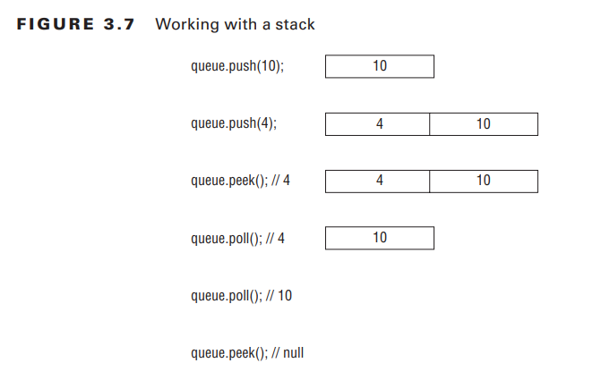

# 3.2 Using Lists, Sets, Maps and Queues

A collection is a group of objects stored in a single object.
The **Java Collections Framework** is a group of classes in java.util for storing collections
This framework consists of 4 main interfaces:

1. **List**: An ordered collection which allows duplicates and can be accessed via index

2. **Set**: An unordered collection which does not allow duplicates

3. **Queue**: A collection with a specific ordering for processing, e.g. first-in first-out.

4. **Map**: a collection which maps keys to values where duplicate key is not allowed

The below diagram displays the hierarchy of the framework:


The map interfacee does not implement the Collection interface. It is part of the Collections framework even though its not actually a Collection

<br><hr>

# 1 Common Collection Methods

The Collection interface has many useful methods when working with lists, sets and queues.

## **add()**

The add method inserts a new element, and returns whether its successful:

```java
    boolean add(E element)
```

For some type, the add() method always returns true but now with generics:

```java
List<String> list = new ArrayList<>();
System.out.println(list.add("Sparrow")); // TRUE
System.out.println(list.add("Sparrow")); // TRUE

Set<String> set = new HashSet<>();
System.out.println(set.add("Sparrow")); // TRUE
System.out.println(set.add("Sparrow")); // FALSE
```

A set cannot contain duplicates!

<br>

## **remove()**

The remove() method removes a **single matching value** in the Collection and returns whether its successful:

```java
    boolean remove(Object object)
```

Here is an example:

```java
List<String> birds = new ArrayList<>();
birds.add("hawk"); // [hawk]
birds.add("hawk"); // [hawk, hawk]
System.out.println(birds.remove("cardinal")); // FALSE
System.out.println(birds.remove("hawk"));  // TRUE
System.out.println(birds); // [hawk]
```

<br>

## **isEmpty() and size()**

The isEmpty() and size() methods look into how many elements are in Collection:

```java
    boolean isEmpty()
    int size()
```

Here is an example:

    System.out.println(birds.isEmpty()); // true
    System.out.println(bird.size());     // 0
    bird.add("hawk");                    // [hawk]
    bird.add("hawk");                    // [hawk, hawk]
    System.out.println(bird.isEmpty());  // false
    System.out.println(bird.size());     // 2

<br>

## **clear()**

This method discards all elements in collection:

```java
    void clear()
```

E.g.:

```java
birds.add("hawk");  // [hawk]
birds.add("hawk");  // [hawk, hawk]
birds.clear();      // []
```

<br>

## **contains()**

This method checks if a Collection has a certain value:

```java
    boolean contains(Object object)
```

E.g.:

```java
    System.out.println(birds) // [hawk]
    System.out.println(bird.contains("hawk")); // TRUE
    System.out.println(bird.contains("robin")); // FALSE
```

<br><hr>

# 2 Using the List Interface

**A list is an ordered collection which allows duplicates**. Items can be accessed and inserted via an index

<br>

## **Comparing List Implementations**

ArrayList automatically resizes when there is no more space. **Elements can be looked up in constant time**. Adding or removing elements is slower

<br>

### **Big O Notation**

Big O notation is used to talk about performance of algorithms. The letter n is used to represent number of items.

1. O(1) - constant time: regardless of size, the time is the same

2. O(log n) - logarithmic time: better than linear time

3. O(n) - linear time: performance grows linear with time

4. O(n<sup>2</sup>) - quadratic time: code where each loop goes through the data is n squared time.

<br>

### **LinkedList**

A LinkedList implements both List and Queue. It has an additional method to facilitate adding/removing items at beginning/ending in constant time! An older implementation was Vector which was replaced by ArrayList!

<br>

### **Stack**

A stack is useful when you want to add/remove elements from top of the stack

<br>

## **Working with List Methods**

Below are methods part of List interface:

| Method                          | Description                                        |
|---------------------------------|----------------------------------------------------|
| void add(E element)             | Adds element to end                                |
| void add(int index, E elements) | Adds at index, moving rest towards end             |
| E get(int index)                | Returns element at index                           |
| int indexOf(Object o)           | Returns first matching index, otherwise -1         |
| int lastIndex(Object o)         | Returns last matching index, otherwise -1          |
| void remove(int index)          | Removes element at index and moves rest forwards   |
| void remove(Element e)          | Removes specified element                          |
| E set(int index, E e)           | Replaces element at index with e. Returns original |

<br>

Here is an example

```java
    list<String> list = new ArrayList<>();
    list.add("SD"); // [SD]
    list.add(0, "NY"); // [NY, SD]
    list.set(1,"FL"); // [NY, FL]
    list.remove("NY"); // [FL]
    list.remove(0); // []
```

<br>

## **Loopng Through a List**

We can loop through a list using an enhanced loop:

```java
    for (String string: list) {
        System.out.println(string);
    }
```

We can also use an iterator:

```java
    Iterator<String> iter = list.iterator();
    while (iter.hasNext()) {
        String string = iter.next();
        System.out.println(string);
    }
```

<br><hr>

# 3 Using the Set Interface

Sets should be used when you don't want duplicates! There are different implementations of the Set interface: HashSet and TreeSet

<br>

## **HashSet Implementation**
HashSet stores elements in a hashtable, meaning elements are hashed and objects are retrieved using hashCode() method - which is efficient!

The **benefit** is adding elements and checking existence occurs at constant time! But you lose ordering of elements!

<br>

## **TreeSet Implementation**

The TreeSet is a *sorted* tree structure. While ordered, checkig and adding elements is slower at O(log n) time!


See the below which compares HashSet and TreeSet:


<br>

## **Working with Set Methods**

The Set interface doesn't not have any unique methods from Collection methods!

HashSet Example:


```java
    Set<Integer> set = new HashSet<>();
    boolean b1 = set.add(66);   // TRUE
    boolean b2 = set.add(10);   // TRUE
    boolean b3 = set.add(66);   // FALSE
    boolean b4 = set.add(8);    // TRUE
    for (Integer integer: set) System.out.println(integer+", ");    // 66,8,10
```

Tree Example:

```java
    Set<Integer> set = new TreeSet<>();
    boolean b1 = set.add(66);   // TRUE
    boolean b2 = set.add(10);   // TRUE
    boolean b3 = set.add(66);   // FALSE
    boolean b4 = set.add(8);    // TRUE
    for (Integer integer: set) System.out.println(integer+",");    // 8,10,66 
```

<br>

## **The NavigableSet Interface**

The TreetSet implements the **NavigableSet interface**. This interface has the following methods:

| Method         | Description                            |
|----------------|----------------------------------------|
| E lower(E e)   | Returns greatest element < e, or null  |
| E floor(E e)   | Returns greatest element <= e, or null |
| E ceiling(E e) | Returns smallest element > e, or null  |
| E higher(E e)  | Returns smallest element >= e, or null |

Example

```java
    NavigableSet<Integer> set = new TreeSet<>();
    for (int i=1; i<=20; i++) set.add(i);
    System.outl.println(set.lower(10));     // 9
    System.outl.println(set.ceiling(10));   // 10
    System.outl.println(set.higher(20));    // 21
    System.outl.println(set.ceiling(20));   // null
```

<br><hr>

# 4: Using the Queue Interface

The Queue is used when you want to add/remove elements in a certain order. Queues are assumed FIFO (first in, first out):


<br>

## **Comaring Queue Implementations**

The *LinkedList* is a **double-ended queue** - elements can be added to front or back of the queue.

- LinkedList is both a List and a Queue but lacks the efficiency of a pure queue.

*ArrayDeque* is a "pure" double ended queue which is more efficient than LinkedList.


<br>

## **Working with Queue Methods**


ArrayDeque inherits from Collections and has 7 additional methods:

| Method             | Description                                                         | For Queue | For Stack |
|--------------------|---------------------------------------------------------------------|-----------|-----------|
| boolean add(E e)   | Adds element at back of queue and returns true, or throws exception | Yes       | No        |
| E element()        | Returns next element, or if empty throws exception                  | Yes       | No        |
| boolean offer(E e) | Adds an element to back of queue and returns whether succesful      | Yes       | No        |
| E remove()         | Removes and returns next element or, if empty throws exception      | Yes       | No        |
| void push(E e)     | Adds element to front of queue                                      | Yes       | Yes       |
| E poll()           | Removes and returns next element or, if empty returns null          | Yes       | No        |
| E peek()           | Returns next element of returns null if empty returns null          | Yes       | Yes       |
| E pop()            | Removes and returns next element, or if empty throws exception      | No        | Yes       |

<br>

**Example:**

```java
    Queue<Integer> queue = new ArrayDequeue<>();
    System.out.println(queue.offer(10));    // true
    System.out.println(queue.offer(4));     // true
    System.out.println(queue.peek());       // 10
    System.out.println(queue.poll());       // 10
    System.out.println(queue.poll());       // 4
    System.out.println(queue.peek());       // null
```


We can insert elements at the *FRONT* of the queue using the push method!

**Example:**

```java
    ArrayDeque<Integer> stack = new ArrayDeque<>();
    stack.push(10);
    stack.push(4);
    System.out.println(stack.peek());   // 4
    System.out.println(stack.poll());   // 4
    System.out.println(stack.poll());   // 10
    System.out.println(stack.peek());   // null
```



<br><hr>

# 5 Map

Maps are used when you want to identify values by a key.

## Comparing Map Implementations

**HashMap** stores keys in a hash table, meaning it uses hashCode() method on the keys to retrieve values efficiently. Adding elements and retrieving elements occur at constant time. Ordering of map is lost.

**LinkedHashMap** is like HashMap but with ordering.

**TreeMap** stores keys in a sorted tree structure with the tradeoff that adding and checking if key is present occurs at logarithmic time.

<br><hr>

##  Working with Map Methods

The Map interfaces does not extend Collection so it has more specific methods. K and V are using as generic type parameters.


| Method                          | Description                                                     |
|---------------------------------|-----------------------------------------------------------------|
| void clear()                    | Removes all keys and values                                     |
| boolean isEmpty()               | Returns if empty                                                |
| int size()                      | Returns number of elements                                      |
| V get(K key)                    | Returns value of key, otherwise null                            |
| V put(K key, V value)           | Adds or replaces key/value pair. Returns previous value or null |
| V remove(Object key)            | Removes value mapped to key, returns null if no key.            |
| boolean containsKey(Object key) | Returns whether key is in map                                   |
| boolean containsValue(Object)   | Returns where value is in map                                   |
| Set<K> keysSet()                | Returns set of all keys                                         |
| Collection<V> values()          | Returns Collection of all values                                |

<br>

**Example 1:**

```java
    Map<String, String> map = new HashMap<>();
    map.put("koala", "bamboo");
    map.put("lion", "meat");
    map.put("giraffe", "leaf");
    Strning food = map.get("koala"); // basmboo
    for (String key: map.keySet())
        System.out.println(key+","); // koala,giraffe,lion,
```

The ordering of the map is random!

**£xample 2:**

```java
    Map<String, String> map = new TreeMap<>();
    map.put("koala", "bamboo");
    map.put("lion", "meat");
    map.put("giraffe", "leaf");
    for (String key: map.keySet())
        System.out.println(key+","); // giraffe,koala,lion,
```

Ordering is based on alphabetical order!

**Example 3:**

```java
    System.out.println(map.contains("lion"));  // DOES NOT COMPILE
    System.out.println(map.containsKey("lion"));  // true
    System.out.println(map.containsValue("lion"));  // false
    System.out.println(map.size()); // 3
```

<br><hr>

# 6 Comparing Collection Types

## **Java Collection Framework Types**

| **Type** | **Can contain duplicates?** | **Elements Ordered?** | **Has Keys and Values?** | **Must add/remove in specific order?** |
|----------|-----------------------------|-----------------------|--------------------------|----------------------------------------|
| List     | Yes                         | Yes                   | No                       | No                                     |
| Map      | Yes - for values            | No                    | Yes                      | No                                     |
| Queue    | Yes                         | Yes - by definition   | No                       | Yes                                    |
| Set      | No                          | No                    | No                       | No                                     |

<br>

## **Collection Attributes**


| **Type**   | **Java Collections Framework Interface** | **Sorted** | **Calls hashCode?** | **Calls compareTo** |
|------------|------------------------------------------|------------|---------------------|---------------------|
| ArrayList  | List                                     | No         | No                  | No                  |
| ArrayDeque | Queue                                    | No         | No                  | No                  |
| HashMap    | Map                                      | No         | Yes                 | No                  |
| HashSet    | Set                                      | No         | Yes                 | No                  |
| Hashtable  | Map                                      | No         | Yes                 | No                  |
| LinkedList | List, Queue                              | No         | No                  | No                  |
| Stack      | List                                     | No         | No                  | No                  |
| TreeMap    | Map                                      | Yes        | No                  | Yes                 |
| TreeSet    | Set                                      | Yes        | No                  | Yes                 |
| Vector     | List                                     | No         | No                  | No                  |

<br>

## **Allows Nulls**

The following data structures *do not allow nulls*:

1. **TreeMap** - cannot contain null keys but null value is fine

2. **Hashtable** - does not allow null keys or values since its old!

3. **TreeSet** - can not compare null values with non nulls!

4. **ArrayDeque** - null is used to display that collection is empty!


<br>

## **Choosing the right collection type**

I need to know which collection should be used for any given scenario. The below table desribes the reasons for each type:

| **Which class do you choose when want _**                                                                                | **Answer** | **Reason**                                                                                                   |
|--------------------------------------------------------------------------------------------------------------------------|------------|--------------------------------------------------------------------------------------------------------------|
| to  pick the top zoo map off a stack of maps                                                                             | ArrayDeque | Since we need last in first out, we need a stack.                                                            |
| to sell tickets to people in the order in which they appear in line and tell them their position in line                 | LinkedList | We need first in, first out so a queue. Indexes are needed so we used LinkedList                             |
| to write down the first names of all the elephants so you can tell them to a person each time they ask, names not unique | ArrayList  | Duplicates means we need a list, since we are accessing more than inserting we use ArrayList over LinkedList |
| to list unique animals that you want to see at the zoo today                                                             | HashSet    | Since we do not care about insertion order, we use the most efficient type                                   |
| to list unique animals that you want to see at the zoo today in alphabetical order                                       | TreeSet    | We need a sorted set, so we can not use HashSet                                                              |
| to look up animals on a unique identifier                                                                                | HashMap    | No sorting needed, so we use most basic map                                                                  |