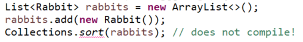

<link href="../../styles.css" rel="stylesheet"></link>

# 🟪 3.5: Searching and Sorting

## Table of Contents

[1 Sorting](#sorting)

[2 Searching](#searching)

# 🟪 1 - Sorting

In order to sort a collection it must implement Comparable!

Suppose we have this Rabbit class:

```java
    class Rabbit {
        int id;
    }
```

We are unable to use the Collections.sort() method without compiler error:



We can fix this by overloading the sort() method with a Comparator!

```java
    List<Rabbit> rabbits = new ArrayList<>();
    rabbits.add(new Rabbit());
    Comparator<Rabbit> c = (r1, r2) -> r1.id - r2.id;
    Collections.sort(rabbits, c);
```

Unlike sort(), collections do not require a class to be Comparable at compile time!

```java
    public class UseTreeSet {
        static class Rabbit { int id; }
        public static void main(String[] args){
            Set<Duck> ducks = new TreeSet<>
            ducks.add("Puddles");
            Set<Rabbit> rabbits = new TreeSet<>(); // completely fine!
            rabbits.add(new Rabbit()); // throws exception!
        }
    }
```

The line where the Rabbit is added cause the exception because the treeSet tries to sort the rabbits!

We can instruct the Collection on how to sort:

```java
Set<Rabbit> rabbits = new TreeSet<>(new Comparator<Rabbit>(){
    public int compare(Rabbit r1, Rabbit r2){
        return r1.id = r2.id;
    }
});
```

<hr>

# 🟪 2 - Searching

The binarySearch() method only has a defined return if the collection is sorted!

The binarySearch() method can be supplied with a Comparator object:

```java
List<String> names = Arrays.asList("Fluffy", "Hoppy");
Comparator<String> c = Comparator.reverseOrder();
int index = Collections.binarySearch(names, "Hoppy", c);;
System.out.println(index); // -1
```

Since the list is in descending order, the binarySearch is not defined!

