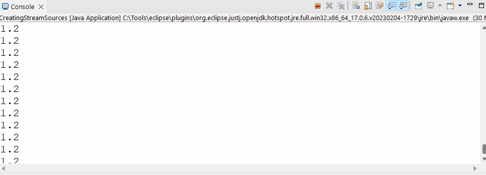

<link href="../../styles.css" rel="stylesheet"></link>

# 🧠 4.4 Using Streams

* A stream is a sequence of data. A stream pipeline is the operations that run on a stream to produce a result. A stream pipeline has three parts:

1) Source - where the stream comes from

2) Intermediate Operations: transform the stream into another one

3) Terminal Operations: actually generate the result

## 🔴 4.4.1 Creating Stream Sources

* There are two types of streams: finite and infinite

### ⭐ Finite Streams ⭐

* We can create finite streams by defining the elements explicitly:

```java
Stream<String> empty = Stream.empty();
Stream<Integer> singleElement = Stream.of(1);
Stream<Integer> fromArray	  = Stream.of(1,2,3);
```

* We can convert lists to streams too:

```java
List<String> list = Arrays.asList("a","b","c");
Stream<String> fromList = list.stream();
// we can process a stream elements in paralleL
Stream<String> fromListParallel = list.parallelStream();
```

* We created a parallel stream which lets us do parallel options (we will see this in concurrency)

### ⭐ Infinite Streams ⭐

* We can create infinite streams by specifying a pattern:

```java
Stream<Double> randoms = Stream.generate(Math::random);
randoms.forEach(System.out::println);
```

* If we look at the console:


* We can also create a stream containing constant values:

```java
Stream<Double> constant = Stream.generate(() -> 1.2);
constant.forEach(System.out::println);
```



* We can specify an iteration pattern using `iterate()`:

```java
Stream<Integer> oddNumbers = Stream.iterate(1, n-> n+2);
oddNumbers.forEach(System.out::println);
```

<hr>

## 🔴 4.4.2 Using Common Terminal Operations

* You can perform a terminal operation without any intermediate operations but not the other way round. Reductions are a special type of termonal operation where all of the contents of the streak are combined into a single primitive or `Object`.

* The following table summarises this section of the book:

| Method        | What Happens for Infinite Streams | Return Value  | Reduction |
| ------------- | --------------------------------- | ------------- | --------- |
| `allMatch/anyMatch/noneMatch` | Sometimes terminates | boolean    | No        |
| `collect()`     | Does not terminate                | varies        | Yes       |
| `count()`     | Does not terminate                | `long`        | Yes       |
| `findAny()/findFirst()` | Terminates              | `Optional<T>` | No        |
| `forEach()`   | Does not terminate                | void          | No        |
| `min()/max()` | Does not terminate                | `Optional<T>` | No        |
| `reduce()`    | Does not terminate                | varies        | Yes       |

### ⭐ `count()` ⭐

* This operation terminates only if the stream is optional and returns the number of elements of the stream as a long, it would have the following signature:

```java
long count()
```

* Example:

```java
Stream<Integer> nums = Stream.of(1,2,3);
System.out.println(nums.count()); // 3
```

### ⭐ `min() and max()` ⭐

* These methods let you pass a custom Comparator and returns the largest and smallest value according to the sorting order. These methods have the following signatures:

```java
Optional<T> min(<? super T> comparator)
Optional<T> max(<? super T> comparator)
```

* Example:

```java
Comparator<String> byLength = (x,y) -> x.length()-y.length();
Stream<String> strings = Stream.of("1", "4444", "666666");
System.out.println(strings.max(byLength)); // Optional[666666]
// System.out.println(strings.max()); // COMPILER ERROR
```

* NOTE: if the stream is empty then the comparator is never called from min()/max()


### ⭐ `findAny() and findFirst()` ⭐

* These two methods will return an optional of an element if the stream is non-empty. If the stream is empty then it returns `Optional.empty`. E.g.:

```java
Stream<Integer> nonEmpty = Stream.of(1);
Stream<Integer> empty	 = Stream.empty();
System.out.println(nonEmpty.findFirst()); // Optional[1]
System.out.println(empty.findAny()); // Optional.empty
```

* These two methods have the following signatures:

```java
Optional<T> findAny()
Optional<T> findFirst()
```

* Even with infinite streams, these two methods will always terminate!😱 E.g.:

```java
Stream<String> monkies = Stream.generate(()-> "monkey");
System.out.println(monkies.findAny()); // Optional[monkey]
```

### `allMatch(), anyMatch() and noneMatch()`

* The operator MAY OR MAY NOT terminate on an infinite stream - this is dependent upon the data🤔. This is NOT a reduction as we are not looking at ALL the elements.

* These methods have the following signatures:

```java
boolean anyMatch(Predicate <? super T>)
boolean allMatch(Predicate <? super T>)
boolean noneMatch(Predicate <? super T>)
```

* Example:

```java
List<String> list 	    = Arrays.asList("monkey", "2", "chimp");
Stream<String> infinite = Stream.generate(()->"chimp");
Predicate<String> pred  = x -> Character.isLetter(x.charAt(0));

System.out.println(list.stream().anyMatch(pred));     // true
System.out.println(list.stream().allMatch(pred));     // false
// System.out.println(infinite.anyMatch(pred)); 	  // true
System.out.println("infi" + infinite.allMatch(pred)); // does not terminate
```

### ⭐ `forEach()` ⭐

* Calling forEach on an infinite stream does not terminate ❗

* This method has the following signature:

```java
void forEach(Consumer<? super T> action)
```

* You can not use a for loop on a Stream! ❗

### ⭐ `reduce()` ⭐

* The reduce method reduces the stream to a single object. It has the following signatures:

```java
T reduce(T identity, BinaryOperator<T> accumulator)
Optional<T> reduce(BinaryOperator<T> accumulator)
<U> U Reduce(U identity, BiFunction<U,? super T, U> accumulator, BinaryOperator<U> combiner)
```

* The most common way of doing a reduction is to start with an initial value and keep mergeing the next value. E.g. suppose we want to concatenate an array of strings:

```java
String[] arr = {"Shiv ", "hates ", "Java "};
Stream<String> stream = Stream.of(arr);
String reduction = stream.reduce("", (x,y) -> x.concat(y));
System.out.println(reduction); // "Shiv hates Java 
```

* We could write this as a method reference:

```java
Stream<String> stream2 = Stream.of(arr);
String red = stream2.reduce("", String::concat);
System.out.println(red);  // "Shiv hates Java " 
```

* Here's an example of finding the product of an array of numbers:

```java
Integer[] nums = {3,4,2};
Stream<Integer> intStream = Stream.of(nums);
int product = intStream.reduce(1, (a,b) -> a*b);
System.out.println(product); // 24
```

* If we DO NOT SET THE IDENTITY, Then an Optional is returned!

<hr>

## 🔴 4.4.3 Using Common Intermediate Operations

* Intermediate operations will return an infinite stream operating on infinite streams

### ⭐ `filter()` ⭐

* The `filter()` method returns a Stream with elements which match a given expression. Here is the method signature:

```java
Stream<T> filter(Predicate<? super T> predicate)
```

* Here's an example which filters items which begin with "m":

```java
Stream<String> strings = Streaml.of("monkey", "gorilla", "bear");
s.filter(x-> x.startsWith("m")).forEach(System.out::println); // monkey
```

### ⭐ `distinct()` ⭐

* The `distinct()` method removes the duplicates from a stream! This has the following signature:

```java
Stream<T> distinct()
```

* Here is an example:

```java
Stream<String> animals = Stream.of("duck", "duck", "duck", "goose");
animals.distinct().forEach(System.out::print); // duckgoose
```


### ⭐ `limit() and skip()` ⭐

* These two methods make the stream SMALLER. They CAN make an infinite stream finite!

* They have the following signatures:

```java
Stream<T> limit(int maxSize)
Stream<T> skip(int n)
```

* The limit method lets us limit the number of elements of the stream:

```java
Stream<Integer> sequence = Stream.iterate(1,n-> n+2);
sequence.limit(2).forEach(System.out::println); // 1 3

Stream<Integer> sequence2 = Stream.iterate(1,n-> n+2);
sequence2.skip(100).limit(2).forEach(System.out::println); // 201 203
```


### ⭐ `map()` ⭐
 
 * The map() method creates a 1-1 mapping frome elements in stream to the elements of the next step in stream.

 * It has the following signature:

 ```java
 <R> Stream<R> map(Function<? super T, ? extends R> mapper)
 ```

```java
Stream<String> words = Stream.of("Shiv", "hates", "Java");
words.map(x-> x.length()).forEach(System.out::println); // 4 5 4
```


### ⭐ `flatMap()` ⭐

* This will take each inner elements of a stream and put them at top level in a single stream. This can be used to remove empty elements.

* This has the following signature:

```java
<R> Stream<R> flatMap(Function<? super T, ? extends Stream<? extends R>> mapper)
```

* Here's an example:

```java
// using flat map:
List<String> empty = Arrays.asList();
List<String> one = Arrays.asList("Shiv");
List<List<String>> nested = Arrays.asList(Arrays.asList("nested"));

Stream<List> stream = Stream.of(empty, one, nested);
stream.forEach(System.out::println); // [] [Shiv] [[nested]]

Stream<List> stream2 = Stream.of(empty, one, nested);
stream2.flatMap(l -> l.stream()).forEach(System.out::println); //   Shiv [nested]
```

### ⭐ `sorted()` ⭐

* This method returns a sorted stream, it has an overload which lets you pass in a Comparator.

* It has the following signatures:

```java
Stream<T> sorted()
Stream<T> sorted(Comparator<? super T> comparator)
```

* Examples:

```java
// using sorted()
Stream<String> strings = Stream.of("BBBB", "A", "CC");
strings.sorted().forEach(System.out::println); // A BBBB CC

Stream<String> strings2 = Stream.of("BBBB", "A", "CC");
strings2.sorted((x,y) -> Integer.compare(x.length(), y.length())).forEach(System.out::println); // A CC BBBB
```

### ⭐ `peek()` ⭐

* The peek() method is a useful debugging tool! It lets us see the content of a stream without changing it!

* It has the following signature:

```java
Stream<T> peek(Consumer<? super T> action)
```


### ⚠️ Danger: Changing State with peek() ⚠️

* `peek()` is designed to be used to perform an action without changing the streams result!

* In this example, the peek() method is changing the data structure.

```java
List<Integer> numbers = new ArrayList<>(); numbers.add(1);
List<Character> letters = new ArrayList<>(); letters.add('c');	

StringBuilder builder = new StringBuilder();
Stream<List<?>> goodStream = Stream.of(numbers, letters);
goodStream
.peek(l -> builder.append(l))
.map(List::size)
.forEach(System.out::println); // 1 1
System.out.println(builder); // [1][c]

Stream<List<?>> badStream = Stream.of(numbers, letters);
badStream
.peek(l -> l.remove(0))
.map(List::size)
.forEach(System.out::println); // 0 0
```

<hr>


## 🔴 4.4.4 Putting Together the Pipeline

* We can use chaining to express what you want to accomplish rather than how to do it!🤔

* Suppose we want to get the first two names alphabetically which are four characters long.🤔

* 💀 The Java 7 approach would be: 💀

```java
List<String> list = Arrays.asList("Toby", "Anna", "Leroy", "Alex");
List<String> filtered = new ArrayList<>;
for (String name: list)
    if (name.length()==4) filtered.add(name)
Collections.sort(filtered);
```

* Java 8 approach would be:

```java
List<String> list = Arrays.asList("Toby", "Anna", "Leroy", "Alex");
List<String> filteredSorted = list
        .stream()
        .filter(str -> str.length()==4)
        .sorted()
        .limit(2)
        .collect(Collectors.toList()); // [Alex, Anna]
```

* ❓❓❓What do you think the following code does?❓❓❓

```java
Stream.generate(() -> "Elsa")
    .filter(n -> n.length() ==4)
    .sorted()
    .limit(2)
    .forEach(System.out::println)
```

* My answer: it generates a stream containing infinite "Elsa" strings, the filtering does nothing, sort does nothing. We just get "Elsa" printed out twice✅✅✅

* ❓❓❓What do you think the following code does?❓❓❓

```java
 Stream.generate(() -> "Olaf Lazisson")
    .filter(n -> n.length() == 4)
    .limit(2)
    .sorted()
    .forEach(System.out::println);
```

* ❌❌My answer, nothing gets printed❌❌

* ✅✅Correct answer: the program will hang until we kill it! Nothing gets passed the filter, so the limit never gets its 2 elements✅✅


### ⭐ Peeking behind the Scenes ⭐

* We can use peek to see how the stream pipeline is working behind the scenes.

* Suppose we have the following code:

```java
Stream<Integer> infinite = Stream.iterate(1, x->x+1);
infinite.limit(5)
        .filter(x->x%2==1)
        .forEach(System.out::println); // 1 3 5
```

* What do you think this prints:

```java
Stream<Integer> infinite = Stream.iterate(1, x->x+1);
infinite.limit(5)
        .peek(System.out::println)
        .filter(x->x%2==1)
        .forEach(System.out::println); 
```

* ❌❌My Answer: 1  2  3  4  5❌❌

* ✅✅Correct answer: 1  1  2  3  3  4  5  5✅✅

* The number one gets past the limit, it then gets past the filter so gets printed again. Number two only gets printed once since it doesn't get past filter!

* ❓❓❓What do you think this prints❓❓❓

```java
Stream<Integer> infinite = Stream.iterate(1, x->x+1);
infinite.filter(x->x%2==1)
        .peek(System.out::println)
        .limit(5)
        .forEach(System.out::println);
```

* ✅✅My Answer: 1 gets past filter so gets printed, and gets past limit and gets printed again. 2 does not get past filter. So it will print "11333557799"✅✅


<hr>

## 🔴 4.4.5 Printing a Stream

* Our ability to print a stream is depended on use of intermediate operations and if the stream is infinite.

* Here are some common approached to print a stream:

| Option                           | Works for infinite Streams?      | Destructive to Stream? |
| -------------------------------- | -------------------------------  | ---------------------- |
| `s.forEach(System.out::println)` | No                               | Yes                    |
| `s.limit(5).forEach(System.out::println)` | No                      | Yes                    |
| `s.peek(System.out::println)`             | No                      | No                     |
| `sout(s.collect(Collectors.toList()))`  | No                     | Yes                       |

* Most of these are destructive - we can not use the stream after printing.
 