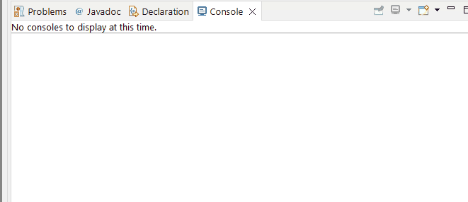

<link href="../../styles.css" rel="stylesheet"></link>

# 📝 Chapter 7: Revision Notes

# 🧠 7.1 Introducing Threads
* A thread is the smallest unit of execution that can be scheduled by OS
* A task is a single unit of work performed by a thread
* A process is a group of threads executing in a shared environment, sharing the same memoery space and can communicate with each other.
* Single-threaded processes contain exactly one thread
* Multi-threaded processes have more than one thread

## 🟥 7.1.1 Distinguishing Thread Types
* A system thread is created by the JVM and runs in background of application, e.g. for garbage collection
* A user-defined thread is created by the developer, e.g. the main method is a user-defined thread but we can create more user-defined thrads
* Hence we call single-threaded applications ones which have only the main method.

<hr>

## 🟥 7.1.2 Understanding Thread Concurrency
* Concurrency is thte propertty of executing multtiple threads and processes at the same time
* Concurrency can benefit an application, even on single core CPUs
* OSs use a thread scheduler to determine which tthreads should be running currently.
* A thread priorty is a numeric value associated with a thread, which is to be used by the thread scheduler.

<hr>

## 🟥 7.1.3 Introducing Runnable
* `Runnable` is a functional interface which takes no arguments, does not throw checked exception and returns void,
:
```java
public interface Runnable {
    void run();
}
```
* Here are some examples:
```java
Runnable r = () ->  System.out.println("hello");
Runnable r2 = new Runnable() {
    public void run() {
        // TODO Auto-generated method stub
        
    }
};
Runnable r3 = () -> {int i=10; i++;};
Runnable r4 = () -> null; // COMPILER ERROR
```

<hr>

## 🟥 7.1.4 Creating a Thread
* You can instantiate the `Thread` class in order to complete a task
* You can execute a task by either:
1) Padding in a Runnable lambda/ohject
2) Create a class which extends Thread, and implement run() method

```java
Thread thr = new Thread(()->System.out.println("hello"));
thr.run(); // hello
```

```java
public class Printer extends Thread {
    public void run() {
        for(int i=0;i<3;i++) System.out.print(i+" ");
    }
    public static void main() {
        (new Printer()).start(); // 0 1 2
    }
}
```

* The order in which results of a thread are not guaranteed

<hr>

## 🟥 7.1.5 Polling with Sleep
* Polling is the process of checking data intermittently at some fixed interval
* The `Thread.sleep()` method is used to implement polling.
* This method throws `InterruptedException`
* E.g.:
```java
public class CheckResults {
    static long counter = 0L;
    static long limit = 1_000_000_000L;;
    public static void main(String[] args) throws InterruptedException {
        new Thread(() -> {
            for(long i=0;i<limit;i++) CheckResults.counter++;
        }).start();
        while(counter<limit) {
            System.out.println(counter+" not reached yet");
            Thread.sleep(1); // 1ms
        }
        System.out.println(counter+" reached!");
    }
}
```
* This prints the following:
```
0 not reached yet
55480739 not reached yet
202760739 not reached yet
350824739 not reached yet
473640739 not reached yet
559944739 not reached yet
707944739 not reached yet
847736739 not reached yet
1000000000 reached!
```

<br><hr>

# 🧠 7.2 Creating Threads with the `ExecutorService`
* The `ExecutorService` creates and managed threads for you

## 🟥 7.2.1 Introducing the Single-Thread Executor
* The `Executors` is a factory class to obtain instances of ExeuctorServices
* Here is how to get a single threaded thread executor:
```java
ExecutorService service = null;
try {
    service = Executors.newSingleThreadExecutor();
    service.execute(
        () -> System.out.println("Began printing zoo")
    );
    service.execute(
        () -> {for(int i=0;i<3++;i++)
            System.out.println("Printing record: "+i);}
    );
    service.execute(
        () -> System.out.println("Finished printing zoo");
    )
} finally {
    if(service!=null) service.shutdown();
}
```
* The results do not have a guaranteed order:
```
Began printing zoo
Printing record: 0
Finished printing zoo
Printing record: 1
Printing record: 2
```
* If we do not shutdown the ExecutorService, the program will not terminate!

<hr>

## 🟥 7.2.2 Shutting Down a Thread Executor
* It is essential to call `shutdown()` on a thread executor, otherwise the application will never terminate
* A daemon thread is a background thread which can continue running even when application terminates
* A thread executor creates a NON-DAEMON thread!
* There are 3 stages of the ExecutorService lifecycle:
1) `Create new thread executor`
- Accepts and executes new tasks
2) `Shutting down`
- Rejects new tasks
- Still continues to executes tasks
- `isShutdown() = true`
3) `Shutdown`
- This is when all tasks are finished
- No running tasks
- `isTerminated() = true`
<br>

* `shutdownNow()` returns a `List<Runnable>` os taskks which were submitted but never started

<hr>

## 🟥 7.2.3 Submitting Tasks
### 🟡 ExecutorService Methods
* We have 5 different methods for ExecutorService:
1) `void execute(Runnable command)`
```java
Runnable r = () -> System.out.println("runnable");
sevice.execute(r); // prints runnable
```
2) `Future<?> submit(Runnable task)`
```java
Runnable r = () -> System.out.println("runnable");
Future<?> f1 = sevice.submit(r); // prints runnable
System.out.println(f1.get()); // prints null
```
3) `<T> Future<?> submit(Callable<T> task)`
```java
Callable<Integer> c = () -> 1;
Future<?> f1 = sevice.submit(r);
System.out.println(f1.get()); // prints 1
```
4) `<T> List<Future<T>> invokeAll(Collection<? extends Callable<T>> tasks)`
- This method will wait indefinitely until all tasks are complete
```java
Callable<Integer> c = () -> 1;
List<Callable<Integer>> list = Arrays.asList(c, c);
List<Future<Integer>> f3 = service.invokeAll(list);
System.out.println(f3.get(0).get()); // 1
System.out.println(f3.get(1).get()); // 1
```
5) `<T> T invokeAny(Collection<? extends Callable<T>> tasks)`
- This method will execute the tasks asynchrously, returning the result of one of them and cancelling any unfinished tasks
```java
Callable<Integer> c1 = () -> 1;
Callable<Integer> c2 = () -> 2;
List<Callable<Integer>> list2 = Arrays.asList(c2, c2);
Integer x = service.invokeAny(list2);
System.out.println(x); // prints either 1 or 2
```

<hr>

## 🟥 7.2.4 Waiting For Results
* A `Future` object is returned when calling `submit`. E.g.:
```java
Future<?> future = service.submit(() -> System.out.println("Hello Zoo"));
```
### 🟡 Future Methods
1) `boolean isDone()` - if the task is completed, throws an exception, or is cancelled, then returns true
2) `boolean isCancelled()` - if the task was cancelled before completing normally, then returns true
3) `boolean cancel()` - attempt to cancel execution of task
4) `V get()` - retrieves result of task
5) `V get(long timeout, TimeUnit unit)` - waits the specified amount of time to retrieve the result. Throws `TimeoutException` if out of time

<br>

* Here is the counter example which uses a Future object to poll for the results:
```java
public class CheckResultsV2 {
    private static long counter = 0;
    static long limit = 1_000_000_000L;
    public static void main(String[] args) {
        ExuctorService service = null;
        try {
            service = Executors.newSingleThreadExecutor();
            Future<?> result = service.submit(() -> {
                for(long i=0;i<limit;i++) counter++;
            });
            result.get(100, TimeUnit.MILLISECONDS);
            System.out.println(counter+" limit reached");   
        } catch (TimeoutException e) {
            System.out.println("Not reached in time");
        } finally {
            if(service!=null) service.shutdown();
        }
    }
}
```
* If the for loop has finished within the 100ms limit, then it will print:
```java
1000000000 limit reached
```
* If the task does not complete in time, then it will print the following for example:
```java
7367732825 not reached in time
```

<br>

### 🟡 Introducing Callable
* The `Callable` is a functional defined as:
```java
public interface Callable<V> {
    V call() throws Exception;
}
```
* Here is an example of using Callable:
```java
public class AddData {
    public static void main(String[] args) throws InterruptedException,
        ExecutionException {
            ExecutorService service = null;
            try {
                service = Executors.newSingleThreadExecutor();
                Future<Integer> result = 
                    service.submit(()->30+11);
                System.out.println(result.get()); // 41
            } finally {
                if(service!=null) service.shutdown();
            }
        }
}
```
* Since Callable throws a checked exception, it means we can write lambdas with code which throws checkeed exceptions without try/catch:
```java
service.submit(()-> {Thread.sleep(1000); return null; });
service.submit(()-> {Thread.sleep(1000); }); // COMPILER ERROR
```

<br>

### 🟡 Waiting for All Tasks to Finish
* Suppose we do not need the results of the tasks and are finished with using the thread executor, then we can used `awaitTermination(long timeout, TimeUnit unit)`. 
* This method waits for the specified amount of time to complete all tasks
* E.g.:
```java
ExecutorService service = null;
try {
    service = Executors.newSingleThreadExecutor();
    // tasks for thread executor
} finally {
    if(service != null) service.shutdown();
}
if(service != null) {
    service.awaitTerminated(1, TimeUnit.MINUTES);
    // check if all tasks are finished
    if (service.shutdown())
        System.out.println("All tasks finished");
    else
        System.out.println("At least one task is still running");
}
```

<hr>

## 🟥 7.2.5 Scheduling Tasks
* The `ScheduledExecutorService` class is used to schedule tasks with delays repeatedly
* We again use the `Executors` factory class to obtain an instance:
```java
ScheduledExecutorService service 
    = Executors.newSingleThreadScheduledExecutor();
```

### 🟡 ScheduledExecutorService methods
* These methods are only available on the `ScheduledExecutorService`!
* The following will not compile:
```java
ExecutorService service 
    = Executors.newSingleThreadScheduledExecutor();
service.schedule(()->1, 1, TimeUnit.SECONDS); // COMPILER ERROR
```

1) `schedule(Callable<V> callable, long delay, TimeUnit unit)` 

2) `schedule(Runnable command, long delay, TimeUnit unit)`
```java
ScheduledExecutorService service
    = Executors.newSingleThreadScheduledExecutor();
Future<?> f = service.schedule(()->{
    System.out.println("hello world");
}, 10, TimeUnit.SECONDS);
// prints hello world after 10s
```

3) `scheduleAtFixedRate(Runnable command, long initialDelay, long period, TimeUnit)`
* Executes the runnable after initial delay, creating a new task every fixed period of time
```java
ScheduledExecutorService scheduledService
    = Executors.newSingleThreadScheduledExecutor();
scheduledService.scheduleAtFixedRate(
    ()->System.out.println("hello"),
    0, 1, TimeUnit.SECONDS);
scheduledService.schedule(()->1, 1, TimeUnit.SECONDS);
```
* This prints the following:




4) `scheduleAtFixedDelay(Runnable command, long delay, TimeUnit unit)`
* Executes the runnable after initial delay, creating a new task after termination of previous and fixed period of time
```java
scheduledService.scheduleWithFixedDelay(
    ()->System.out.println("hello"),
    0, 1, TimeUnit.SECONDS);
```

<hr>

## 🟥 7.2.6 Increasing Concurrency with Pools
* A **Thread Pool** is a group of pre-instantiated reusable threads to perform arbritary tasks

### 🟡 Executors Methods
* The `Executors` have the following methods
1) `ExecutorService newSingleThreadExecutor()` - a single worker thread is operating off an unbounded queue.
2) `ScheduledExecutorService newSingleThreadScheduledExecutor`
3) `ExecutorService newCachedPool()` - creates a thread pool which creates new threads as needed
4) `ExecutorService newFixedThreadPool(int nThreads)` - creates a thread pool which reuses a fixed number of threads operating off an unbounded queue
5) `ScheduledExecutorService newScheduledThreadPool(int nThreads)` - create a thread pool for scheduling commands


<br><hr>

# 🧠 7.3 Synchronizing Data Access
* **Thread Safety** is the property that an object guarantees safe execution by multiple threads at the same time
* Here is an example of a non-thread safe object:
```java
public class SheepManager {
    int sheepCount = 0;
    void incrementAndReport() {
        System.out.println((++sheepCount)+" ");
    }
    public static void main(String[] args) {
        ExecutorService service = null;
        try {
            service = Executors.newFixedThreadPool(20);
            SheepManager manager = new SheepManager();
            for(int i=0;i<10;i++)
                service.submit(()->manager.incrementAndReport());
        } finally {
            if(service!=null) service.shutdown();
        }
    }
}
```
* Running this prints the following samples:
```java
3 10 9 8 7 6 4 5 1 2
1 9 2 8 7 6 4 5 5 3 
```
<hr>

## 🟥 7.3.1 Protecting Data with Atomic Classes
* **Atomic** is the property that a single unit of execution can be carried out without interference from other threads.
* Atomic classes ensure data is consistent!
* The Concurrency API includes atomic classes:
1) `AtomicBoolean`
2) `AtomicInteger`
3) `AtomicIntegerArray`
4) `AtomicLong`
5) `AtomicLongArray`
6) `AtomicReference`
7) `AtomicReferenceArray`

* These classes have access to the atomic methods:
1) `get()`
2) `set()`
3) `getAndSet()`
4) `incrementAndGet()`/`getAndIncrement()`
5) `decrementAndGet()`/`getAndDecrement()`

* We can update our `SheepManager` to use a thread safe counter:
```java
public class SheepManagerV2 {
	AtomicInteger sheepCount = new AtomicInteger(0);
	void incrementAndReport() {
		System.out.print(sheepCount.incrementAndGet()+" ");
	}
	public static void main(String[] args) {
		SheepManagerV2 manager = new SheepManagerV2();
		ExecutorService service = null;
		try {
			service = Executors.newFixedThreadPool(20);
			for(int i=0;i<10;i++)
				service.submit(()->manager.incrementAndReport());
		} finally {
			if(service!=null) service.shutdown();
		}
	}
}
```
* This prints the following samples:
```java
1 10 9 3 2 8 7 4 6 5 
2 10 9 7 8 6 5 4 1 3 
```
<hr>

## 🟥 7.3.2 Improving Access with Synchronized Blocks
* We can synchronize access of threads to code, using the `synchronized` keyword which takkes a `lock`
* E.g.:
```java
SheepManagerV3 manager = new SheepManagerV3();
synchronized(manager) { // this is a synchronized block
    // code here
}
```
* We update the `SheepManager` class:
```java
public class SheepManagerV3 {
    int sheepCount = 0;
    void incrementAndReport() {
        synchronized(this) { // the lock is the SheepManagerV3.class
            System.out.print((++sheepCount)+" ");
        }
    }
    public static void main(String[] args) {
        ExecutorService service = null;
        SheepManagerV3 manager = new SheepManagerV3();
        try {
            service = Executors.newFixedThreadPool(20);
            for(int i=0;i<10;i++){
                service.submit(()->manager.incrementReport());
            }
        } finally {
            if(service!=null) service.shutdown();
        }
    }
}
```
* This will ALWAYS print the following:
```java
1 2 3 4 5 6 7 8 9 10
```

## 🟥 7.3.3 Synchronizing Methods
* We can apply the `synchronized` keyword to methods
* The following are equivalent:
```java
void incrementAndReport() {
    synchronized(this) {
        System.out.print((++sheepCount)+" ");
    }
}
synchronized void incrementAndReport() {
    System.out.print((++sheepCount)+" ");
}
```
* We can apply this keyword to static methods.
* The following are equivalent:
```java
static void printDaysWork() {
    synchronized(SheepManager.class) {
        System.out.print("Finished work");
    }
}
static synchronized void printDaysWork() {
    System.out.print("Finished work");  
}
```

<br><hr>

# 🧠 7.4 Using Concurrent Collections
* The Concurrency API includes Concurrent Collections which have built in thread safe methods

## 🟥 7.4.1 Introducing Concurrent Collections
```java
Map<String, Object> foodDate = new ConcurrentHashMap<String,Object>();
```
* We can access/modify concurrent collections same way as non-concurrent ones!
<hr>

## 🟥 7.4.2 Understanding Memory Consistency Errors
* **Memory Consistency Errors** - occurs when two threads have inconsistent views of the same data.
* When two threads attempt to modify the same non-concurrent collection, the JVM may throw `ConcurrentModificationException`
```java
Map<String, Object> food = new HashMap<String, Object>();
food.put("pizza",1);
food.put("chicken",2);
for (String key: food.keySet())
    food.remove(key); // throws exception
```
* We can circumvent this by using a concurrent collection:
```java
Map<String, Object> food = new ConcurrentHashMap<>();
food.put("pizza",1);
food.put("chicken",2);
for (String key: food.keySet())
    food.remove(key);
```

<hr>

## 🟥 7.4.3 Working with Concurrent Classes
* There are additional methods to concurrent classes which are not available to the non-concurrent versions.

### 🟡 Concurrent Collection Classes
| Class Name         | Collections FW Interface                   |
| -------------------| -------------------------------------------|
| ConcurrentHashMap  | ConcurrentMap                              |
| ConcurrentLinkedQueue | Queue                                   |
| ConcurrentLinkedDeque | Deque                                   |
| ConcurrentSkipListMap | ConcurrentMap, SortedMap, NavigableSet  |
| ConcurrentSkipListSet | SortedSet, NavigableSet                 |
| CopyOnWriteArrayList  | List                                    |
| CopyOnWriteArraySet   | Set                                     |
| LinkedBlockingQueue   | BlockingQueue                           |
| LinkedBlockingDeque   | BlockingQueue, BlockingDeque            |

<br>

### 🟡 Understanding Blocking Queues
* `BlockingQueue` is like `Queue` except it has methods which will wait a specific amount of time to complete an operation.
* `BlockingQueue` has the following **waiting methods**:
1) `boolean offer(E e, long timeout, TimeUnit unit)` - adds item to a queue waiting for a specified time
2) `E poll(long timeout, TimeUnit unit)` - retrieves and removes an item from the queue

* `LinkedBlockingQueue` maintains a linked list between elements. Here is an example:
```java
try {
    BlockingQueue<Integer> blockingQueue
        = new LinkedBlockingQueue
    blockingQueue.offer(1);
    System.out.println(blockingQueue); // [1]
    blockingQueue.offer(2, 3, TimeUnit.SECONDS);
    System.out.println(blockingQueue); // [1,2]
    int poll = blockingQueue.poll(10, TimeUnit.MICROSECONDS); // 1
}
```

* `BlockingDeque` is like `Deque` but has methods which will wait a specified amont of time:
1) `boolean offerFirst(E e, long timeout, TimeUnit unit)` - adds item to front of queue, waiting for given time
2) `boolean offerLast(E e, long timeout, TimeUnit unit)` - adds item to back of queue, waiting for given time
3) `E pollFirst(long timeout, TimeUnit unit)` - retrieves and removes item from front of queue
4) `E pollLast(long timeout, TimeUnit unit)` - retrieves and removes item from back of queue

* `LinkedBlockingDeque` is a doubly-linked list. Here is an example:
```java
try {
    BlockingDeque<Integer> blockingDeque
        = new LinkedBlockingDeque<>();
    blockingDeque.offer(1); // [1]
    blockingDeque.offerFirst(2, 1, TimeUnit.SECONDS); // [2, 1]
    blockingDeque.offerLast(3, 1, TimeUnit.SECONDS); // [2, 1, 3]
    System.out.println(blockingDeque.poll()); // 2
    System.out.println(blockingDeque.pollFirst(1, TimeUnit.SECONDS));
    // 1
    System.out.println(blockingDeque.pollLast(1,TimeUnit.SECONDS));
    // 3
}
```

<br>

### 🟡 Understanding SkipList Collections
* `ConcurrentSkipListSet` is the concurrent version of `TreeSet`
* `ConcurrentSkipListMap` is the concurrent version of `TreeMap`

<br>

### 🟡 Understanding CopyOnWriteCollections
* `CopyOnWriteArrayList` and `CopyOnWriteArraySet` are slightly different compared to the above
* These classes copy all of its elements to a new underlying structure anytime an element is added, modified or removed from the collection

```java
List<Integer> list = new CopyOnWriteArrayList<>(Arrays.asList(4,3,52));
for(Integer item: list) {
    System.out.print(item+" "); // 4 3 52
    list.add(9);
}
System.out.println(list); // [4, 3, 52, 9, 9, 9]
```
* Notice how the for loop printed 3 elements, but the size of the List was 6 after the for loop finished
* Using an ArrayList would throw a `ConcurrentModificationException` ⚠️
<hr>

## 🟥 7.4.4 Obtaining Synchronized Collections
* We can convert existing non-concurrent collections into their concurrent counter parts!💡

### 🟡 Synchronized Collection Methods
* We have the following methods:
1) `synchronizedCollection(Collection<T> c)`
2) `synchronizedList(List<T> list)`
3) `synchronizedMap(Map<K,V> m)`
4) `synchronizedNavigableMap(NavigableMap<K,V> m)`
5) `synchronizedNavigableSet(NavigableSet<T> s)`
6) `synchronizedSet(Set<T> s)`
7) `synchronizedSortedMap(SortedMap<K,V> m)`
8) `synchronizedSortedSet(SortedSet<T> s)`
* These methods will synchronize the getters/setters but do not synchronize iterators that you may create.

```java
List<Integer> list = Collections.synchronizedList(
    new ArrayList<>(Arrays.asList(4,3,52)));
for (int data: list) {
    System.out.print(data+" ");
    // list.add(9); // throws ConcurrentModificationException
}
```
* The iterators must be manually synchronized
* Also, using these converted exceptions will always throw a `ConcurrentModificationException`!
<br><hr>

# 🧠 7.5 Working with Parallel Streams
* Streams API has built in concurrency support.
* We have previously seen serial streams, we shall now convert these into parallel streams which means results can be processed concurrently
## 🟥 7.5.1 Creating Parallel Streams
1) We can convert an existing Stream to a Parallel Stream using `.parallel()`:
```java
Stream<Integer> stream = Arrays.asList(1,2,3).stream().parallel();
```
- We could use the parallel() method on an already parallel stream
2) OR we can use the `parallelStream()` method on a Collection:
```java
Stream<Integer> stream = Arrays.asList(1,2,3).parallelStream();
```

## 🟥 7.5.2 Processing Tasks in Parallel
* Using a parallel stream means that results may be ordered in an unpredictable way:
```java
Arrays.asList(1,2,3,4,5,6)
    .parallelStream()
    .forEach(s -> System.out.print(s+" "));
// Possible outpus:
// 5 3 1 2 4 6
// 4 2 1 3 6 5
// 5 1 3 2 4 6
```
* We can FORCE ordering with cost to performance using `forEachOrdered()`:
```java
Arrays.asList(1,2,3,4,5,6)
    .parallelStream()
    .forEachOrdered(s -> System.out.print(s+" "));
// ALWAYS PRINTS: 1 2 3 4 5 6
```

* Parallel Streams greatly improve operations which can be done INDEPENDENTLY💡
* E.g. making all elements uppercase:
```java
Arrays.asList("jackal","kangaroo","lemur")
    .parallelStream()
    .map(s -> s.toUpperCase())
    .forEach(System.out::println);
// KANGAROO LEMUR JACKAL
```
* Observe how ordering has been lost!
<br>

* Its common to use parallel streams for filter, map, and forEach
* Here is an example of some imbedded operations in a map lambda:
```java
Arrays.asList("jackal","kangaroo","lemur")
    .parallelStream()
    .map(s -> {System.out.println(s); return s.toUpperCase();})
    .forEach(System.out::println);
// kangaroo KANGAROO lemur jackal JACKAL LEMUR
```

## 🟥 7.5.3 Processing Parallel Reductions
* Parallel reductions are reduction operations on parallel streams!
* Parallel reductions lead to results which can not be determined:
```java
Arrays.asList(1,2,3,4,5,6).parallelStream().findAny().get();
// the value can not be determined until runtime
```
* Results of ordered operations will be consistent with serial streams:
```java
Arrays.asList(1,2,3,4,5,6)
    .parallelStream()
    .skip(5)
    .limit(2)
    .findFirst().get();
// will always return 6
```

<hr>

### 🟡 Combining Results with reduce()
* Consider the following reduction on a serial stream:
```java
Stream<Character> str = Stream.of('1','2','3','4','5');
String string = str
    .reduce("", 
		 (String s, Character c)->{System.out.println("s:"+s+",c:"+c); return s+c;},
		(String t, String u)->{System.out.println("t:"+t+",u:"+u); return t+u;}
    );
```
* Running this code will print the following:
```java
s:,c:1
s:1,c:2
s:12,c:3
s:123,c:4
s:1234,c:5
```
* We can see the accumulator was called, but not the combiner!
* If we use a parallel stream:
```java
Stream<Character> parallelStr = Stream.of('1','2','3','4','5')
    .parallel();
String parallelString = parallelStr
    .reduce("", 
        (String s, Character c)->{System.out.println("s:"+s+",c:"+c); return s+c;},
        (String t, String u)->{System.out.println("t:"+t+",u:"+u); return t+u;} );
```
* This prints the following:
```java
s:, c:3
s:, c:2
s:, c:4
s:, c:1
s:, c:5
t:1, u:2
t:4, u:5
t:3, u:45
t:12, u:345
```
* We can see how the characters were converted to Strings with the identity
* The combiner, then joined up the Strings!

#### 🌱 Requirements for Parallel Reduction with collect() 🌱 

* In order for the final result to be correct, we have the following requirements for the `reduce()` arguments:
1) The `identity` needs to be defined such that for any element in Stream, u, we have that:
```java
combiner.apply(identity, u) = u
```
2) The `accumulator op` needs to be associative:
```java
(a op b) op c = a op (b op c)
```
3) The combiner operator must be associative

<br>

* Here is an example of accumulator not being associative:
```java
System.out.println(Arrays.asList(1,2,3,4,5,6)
    .parallelStream()
	.reduce(0, (a,b)-> {System.out.println("a:"+a+" ,b:"+b); return a-b;});
```
* This prints the following:
```java
a:0 ,b:6 // -6
a:0 ,b;5 // -5
a:0 ,b:2 // -2
a:0 ,b:3 // -3
a:-5 ,b:-6 // 1
a:0 ,b:4 // -4
a:-4 ,b:1 // -5
a:0 ,b:1 // -1
a:-2 ,b:-3 // 1
a:-1 ,b:1 // -2
a:-2 ,b:-5 // 3
```
* If this were a serial stream, then the output would correctly be: -21

<br>

* Here is an example of identity not being valid:
```java
Arrays.asList("w","o","l","f")
    .parallelStream()
    .reduce("X",String::concat);
// XwXoXlXf
```

<hr>

### 🟡 Combining Results with reduce()
* The `reduce()` method also has a combiner as third argument:
```java
Stream<String> stream
    = Stream.of("w","o","l","f").parallel();
SortedSet<String> set
    = stream.collect(
        ()->new TreeSet<>(),
        (a,b)->{System.out.println("a:"+a+",b:"+b); a.add(b);},
        (t,c)->{System.out.println("t:"+t+",c:"+c); t.addAll(c);});
    );
System.out.println(set);
```
* This prints the following:
```java
a:[],b:o
a:[],b:l
a:[],b:w
a:[],b:f
t:[w],c:[o]
t:[l],c:[f]
t:[o, w],c:[f, l]
[f, l, o, w]
```

#### 🌱 Requirements for Parallel Reduction with reduce() 🌱
1) The stream is parallel
2) The parameter of the collect operation has the `Collector.Characteristics.CONCURRENT` characteristic
3) Either the stream is unordered, or the collect operation has the characteristic `Collector.Characteristics.UNORDERED`

* The `Collectors` class has two methods which are BOTH `UNORDERED` AND `CONCURRENT`:
1) `Collectors.toConcurrentMap()`
2) `Collectors.groupingByConcurrent()`

* E.g. 1:
```java
Stream<String> ohMy = Stream.of("lions","tigers","bears")
    .parallel();
ConcurrentMap<Integer, String> map = ohMy
    .collect(Collectors.toConcurrentMap(
        String::length, 
        k -> k,
        (s1, s2) -> s1 + "," + s2));
System.out.println(map); // {5=lions,bears, 6=tigers}
```

* E.g. 2:
```java
Stream<String> ohMy = Stream.of("lions", "tigers", "bears").parallel();
ConcurrentMap<Integer, List<String>> map = ohMy.collect(
    Collectors.groupingByConcurrent(String::length));
System.out.println(map); // {5=[lions, bears], 6=[tigers]}
```


<br><hr>

# 🧠 7.6 Managing Concurrent Processes
* I must be familiar with the following two classes in the `Concu`
## 🟥 7.6.1 Creating a CyclicBarrier
* Suppose we have a situation where there are lions in a cage, and 4 zoo workkers who need to coordinate the tasks:
1) Remove lion from cage
2) Clean the cage, once all lions are removed
3) Begin bring lion into cage, when cage is finished cleaning

* We can coordinate these tasks using `CyclicBarrier`:

```java
public class LionPenManager {
    void removeLion() {
		System.out.println(Thread.currentThread().getId()+" Removing Lion");
	}
	void cleanCage() {
		System.out.println(Thread.currentThread().getId()+" Cleaning cage");
	}
	void addLion() {
		System.out.println(Thread.currentThread().getId()+" Adds Lion");
	}
	public void performTasks() {
		removeLion();
		cleanCage();
		addLion();
	}
}
// MAIN METHOD:
ExecutorService service = null;
try {
    service = Executors.newFixedThreadPool(4);
    LionPenManager manager = new LionPenManager();
    for(int i=0;i<4;i++) {
        service.submit(()->manager.performTasks());
    }
} finally {
    if(service!=null) service.shutdown();
}
```
* The following is a sample from the above:
```java
25 Removing Lion
24 Removing Lion
26 Removing Lion
23 Removing Lion
26 Cleaning Cage
24 Cleaning Cage
26 Adds Lion
25 Cleaning Cage
24 Adds Lion
23 Cleaning Cage
25 Adds Lion
23 Adds Lion
```

<br>

* We can add a logical barrier so that cleaning the cage does not begin till all lions are removed, and no lions are added before the cage is cleaned by all the workers:

```java
public class LionManagerV2 {
      void removeLion() {
		System.out.println(Thread.currentThread().getId()+" Removing Lion");
	}
	void cleanCage() {
		System.out.println(Thread.currentThread().getId()+" Cleaning cage");
	}
	void addLion() {
		System.out.println(Thread.currentThread().getId()+" Adds Lion");
	}
	public void performTasks(CyclicBarrier c1, CyclicBarrier c2) {
		removeLion();
        c1.await();
		cleanCage();
        c2.await();
        System.out.println("c2 barrier limit surpassed");
		addLion();
	}
}
// MAIN METHOD:
Executor service = null;
try {
    service = Executors.newFixedThreadPooll(4);
    LionPenManagerV2 manager = new LionPenManagerV2();
    CyclicBarrierLimit c1 = new CyclicBarrierLimit(4);
    CyclicBarrierLimit c2 = new CyclicBarrierLimit(4,
        ()->System.out.println("*** Pen cleaned!!"));
    for(int i=0;i<3;i++){
        service.submit(()->manager.performTask(c1,c2));
    }
} finally {
    if(service!=null) service.shutdown();
}
```

* Here is a sample of the above:
```java
23 Removing Lion
25 Removing Lion
24 Removing Lion
26 Removing Lion
26 Cleaning Cage
23 Cleaning Cage
24 Cleaning Cage
25 Cleaning Cage
*** Pen cleaned!!
c2 barrier limit surpassed
c2 barrier limit surpassed
c2 barrier limit surpassed
25 Adds Lion
23 Adds Lion
26 Adds Lion
c2 barrier limit surpassed
24 Adds Lion
```

## 🟥 7.6.2 Applying the Fork/Join Framework


<br><hr>

# 🧠 7.7 Identifying Threading Problems

<br><hr>

## 🟥 7.7.1 Understanding Liveness

## 🟥 7.7.2 Managing Race Conditions
