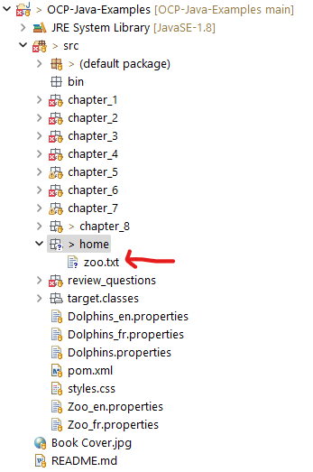

<link href="../../styles.css" rel="stylesheet"></link>


# 🧠 8.1 Understanding Files and Directories
* This chapter focuses on `java.io` API to interact with files and streams
<hr>

## 🟥 8.1.1 Understanding Files and Directories

### 🟡 Conceptuazlizing the File System
* A file is a record within a file system which stores data
* A directory is also a record, but it contains files and directories.
* We shall refer to directories as a file record for the rest of this chapter.
* The file system is in charge of reading and writing data within a compute. 
* Different OS's have different file systems, we shall see how to connect automatically to thesde
* A path is the string representation of a file or directory
* In most file systems, the hierarchy is represented using strings concatenated with forward slashes

### 🟡 Introducing the File Class
* The `java.io.File` class is used to read information about existing files and directories, list contents, create/delete files/directories
* An instance of the `File` class represents the pathname of a particular file or directory on the file system.
* The `File` class cannot read or write data within the file directly, but it can be a passed as a reference to stream class to read and write data.


#### 🌱 Creating a File Object
* The File object is often initialised using either the absolute or relative path.
* The seperate character varies from OS's, we can obtain the seperator character using either:
```java
System.getProperty("file.seperator");
System.out.println(java.io.File.separator);
// both print \ on my windows machine
```

* The following code creates a File object and determines if the path it references exists within the file system:
```java
public class FileSample {
    public static void main(String[] args) {
		File file = new File("\\home\\zoo.txt");
		System.out.println(file.exists()); // false
    }
}
```
* This example uses an absolute path (which does not existt on my pc)
* So that I can verify that this method does indeed work, I find some code which gets the directory of my OCP project:
```java
System.out.println(System.getProperty("user.dir"));
// C:\Users\shiv.kumar\Documents\Github\OCP-Java-Examples
```
* I then create a file in the `src` folder of my project:



* I then created a parent and child class for this file, and ran:
```java
File parent = new File(System.getProperty("user.dir")+"\\src");
File child = new File(parent, "home\\zoo.txt");
System.out.println(child.exists()); // true
```

### 🟡 Commonly Used java.io.File Methods
1) `exists()` 
2) `getName()` - returns name of the file or directory
```java
File parent = new File(System.getProperty("user.dir")+"\\src");
File child = new File(parent, "home\\zoo.txt");
System.out.println(child.getName()); // zoo.txt
```
3) `getAbsolutePath()`
```java
System.out.println(child.getAbsolutePath());
// C:\Users\shiv.kumar\Documents\Github\OCP-Java-Examples\src\home\zoo.txt
```
4) `isDirectory()` - returns true if file is a directory
```java
System.out.println(child.isDirectory()); // false
System.out.println(parent.isDirectory()); // true
```
5) `isFile()` - returns if the file exists
```java
System.out.println(child.isFile()); // true
System.out.println(child.isFile()); // true
File madeup = new File("random.txt");
System.out.println(madeup.isFile()); // false
```
6) `length()` - returns number of bytes in the file
7) `lastModified()` - returns epoch time
8) `delete()` - deletes the file, can delete directory if empty
9) `renameTo(File file)`
10) `mkdir()` - creates directory, returns true if operation is successfully
```java
File newDirectory = new File(parent,"new_directory");
if (!newDirectory.isDirectory())
    newDirectory.mkdir();
System.out.println(newDirectory.exists()); // true
System.out.println(newDirectory.mkdir()); // false as already exists
System.out.println(newDirectory.delete()); // true
```
11) `mkdirs()` - creates directory, and parent structures as needed.
12) `getParent()` - returns path name of the parent directory
```java
System.out.println(child.getParent());
// C:\Users\shiv.kumar\Documents\Github\OCP-Java-Examples\src\home
System.out.println(parent.getParent()); 
// C:\Users\shiv.kumar\Documents\Github\OCP-Java-Examples
```
12) `listFiles()` - returns `File[]` denoting files in the directory
```java
File[] files = child.listFiles();
System.out.println(Arrays.toString(files)); // null
File[] files2 = parent.listFiles();
System.out.println(Arrays.toString(files2)); 
// [C:\Users\shiv.kumar\Documents\Github\OCP-Java-Examples\src\.classpath, ...]
```

## 🟥 8.1.2