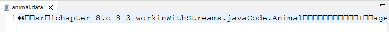

<link href="../../styles.css" rel="stylesheet"></link>


# 🧠 8.3 Working with Streams

<hr>

## 🟥 8.3.1 The FileInputStream and FileOutputStream Classes
* The FileInputStream and FileOutputStream are used to read/write bytes to a file
* The classes have constructors which accept either a File or String which points to location of file
* E.g.:
```java
String location = System.getProperty("user.dir")+"\\src"+ "\\chapter_8\\c_8_3_workinWithStreams\\javaCode\\data.txt";
try (InputStream in = new FileInputStream(location)) {
  int b;
  while((b=in.read())!=-1) {
    System.out.print(b);
  }
}
// prints TIGERS
```
* The `FileOutStream` object is accessed via writing successive bytes using `write(int)`, here is an example of writing `TIGER` to a new file:
```java
String destination = System.getProperty("user.dir")+"\\src"+
	"\\chapter_8\\c_8_3_workinWithStreams\\javaCode\\output.txt";
try (FileOutputStream out = new FileOutputStream()) {
  char[] chars = new char[] {'t', 'i', 'g', 'e', 'r', 's'};
  for(char c: chars) {
    out.write(c);
  }
}
```
* Running the above code will create a new file with text of `tigers` inside!

### 🟡 The BufferedInputStream and BufferedOutputStream Classes
* We can wrap the `FileInputStream` and `FileOutputStream` classes with `BufferedInputStream` and `BufferedOutputStream`
* The `BufferedInputStream` class has a `read(byte[])` method which reutnrs the number of bytes read into the argument array.
* If the return is 0, then we are at the end of file.

```java
public class WorkingWithBufferedInputStream {
  static void copy(File source, File destination) throws IOException {
    try (InputStream in = new BufferedInputStream(new FileInputStream(source));
        OutputStream out = new BufferedOutputStream(new FileOutputStream(destination))) {
          byte[] buffer = new byte[1024];
          int lengthRead;
          while((lengthRead = in.read(buffer)) > 0) {
            System.out.println(lengthRead);
            out.write(buffer,0,lengthRead); 
            out.flush();
          }
        }
  }
  public static void main(String[] args) throws IOException {
    String source = System.getProperty("user.dir")+"\\src"+
				"\\chapter_8\\c_8_3_workinWithStreams\\javaCode\\data.txt";
		String destination = System.getProperty("user.dir")+"\\src"+
				"\\chapter_8\\c_8_3_workinWithStreams\\javaCode\\Returned-data.txt";
		File sourceFile = new File(source); // this file contains the alphabet!
    Fille destinationFile = new File(destination); 
    copy(sourceFile, destinationFile);
    // prints 27 - the length of the source file
    // the data is copied to the destination file
  }
}
```

<hr>

## 🟥 8.3.2 The FileReader and FilerWriter Classes
* The FileReader and FileWriter classes are the most convenient classes for reading and writing text data
* These classes have a `read()` and `write()` which read ad write char values, unlike the byte values from the FileInput/Output classes.
* The Writer class offers a `write(String)` which allows a String object to be directly written to a stream

### 🟡 The BufferedReader and BufferedWriter Classes
```java
static List<String> readFile(Fille source) throws IOException {
  List<String> data = new ArrayList<>();
  try (BufferedReader reader = new BufferedReader(ney FileReader(source))) {
    String s;
    while ((s=reader.readLine()) != null) {
      data.add(s);
    }
  }
  return data;
}

// MAIN METHOD: 
String source = System.getProperty("user.dir")+"\\src"+
				"\\chapter_8\\c_8_3_workinWithStreams\\javaCode\\text.txt"
// this file has 3 lines
List<String> data = readFile(new File(source));
System.out.println(data);
// [Line 1, Line 2, Line 3]
```
<hr>

## 🟥 8.3.3 The ObjectInputStream and ObjectOutputStream Classes
* Serialisation is the process of writing an in memory Java object to the disk, deserialisation is converted the stored data into an object.

### 🟡 The Serializable Interface
* You can serialise a java object provided it implements `java.io.Serializable` - an interface which contains no methods and serves to act as a marker
* You implement `Serializable` to indicate you have taken premeasures to ensure an object can be serialized
* Trying to Serialize a class which does not properly implement Serializable, will throw a `NotSerializablleException`.
* You can apply the `transient` keyword to instance variables to skip deserialization.
* Static fields are also ignored even without the transient keyword
* Here is an example of a class which implements the interface:
```java
public class Animal implements Serializable {
  private static final long serialVersionUID = 1L;
  private String name;
  private int age;
  private char type;
  public Animal(String name, int age, char type) {
    this.name = name; this.age = age; this.type = type;
  }
  public String toString() {
    return "Animal [name=" + name + ", age=" + age + ", type=" + type + "]";
  }
}
```
* The `serialVersionUID` is a good practice to avoid conflicts with deserialisation

### 🟡 Serializing and Deserializing Objects
* The `java.io` API has two classes to achieve this: `ObjectInputStream` and `ObjectOutputStream`
* The `ObjectOutputStream` class has a `void writeObject(Object)` method which if is not serializable or contains an embedded reference to a class which is not Serializable then a `NotSerializableException` at runtime.
* Here is a method which serializes the Animal objects:
```java
static void createAnimalsFile(List<Animal> animals, File dataFile) {
  try (ObjectOutputStream out = new ObjectOutputStream(new FileOutputStream(dataFile))) {
    for (Animal animal: animals) {
      out.writeObject(animal);
    }
  }  
}
```
* The `ObjectInputStream` class has a `Object readObject()` method.
* Here is a method which deserializes data:
```java
static List<Animal> getAnimals(File dataFile) {
  try (ObjectInputStream in = new ObjectInputStream(
    new FileInputStream(new File(dataFile)))) {
      List<Animal> data = new ArrayList<>();
      while(true) {
        Object object = in.readObject();
        if (object instanceof Animal)
          data.add((Animal) object);
      }
    } catch (EOFException e) {

    }
    return data;
}
```
* Here is a program which serialises some Animal data:
```java
List<Animal> animals = new ArrayList<>();
animals.add(new Animal("Monkey", 5, 'M'));
animals.add(new Animal("Parrot", 2, 'B'));
String animalFile = System.getProperty("user.dir")+"\\src"+
    "\\chapter_8\\c_8_3_workinWithStreams\\javaCode\\animal.data";
File dataFile = new File(animalFile);
createAnimalsFile(animals, dataFile);
```
* This created the `animal.data` file with the following inside:



* The folllowing code deserializes the above and prints the results:
```java

```
<hr>

## 🟥 8.3.4 The PrintStream and PrintWriter Classes

<hr>

## 🟥 8.3.5 Review of Stream Classes


