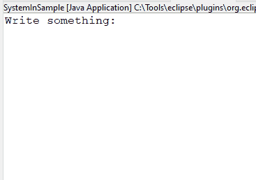

<link href="../../styles.css" rel="stylesheet"></link>


# 🧠 8.4 Interacting With Users
* We shall lookk at the `java.io.Console` class which is an evolved form of the `System.in`/`System.out` methods,
<hr>

## 🟥 8.4.1 The Old Way
* Suppose we want to obtain input from the user
* We need to use `System.in` and wrap it with `InputStreamReader` class
* We then use `BufferedReader` so that the user can enter multiple characters and use termination (enter):
```java
try (BufferedReader reader = new BufferedReader(new InputStreamReader(System.in))) {
  System.out.println("Write something:");
  String userInput = reader.readLine();
  System.out.println("This is what you wrote: "+userInput);
} catch (IOException e) {
  
}
```
* Running the program:



## 🟥 8.4.2 The New Way
* Java 6 introduced `java.io.Console` which is a singleton which is accessed using `System.console()` - this can potentially return null
* Here is the previous program rewritten:
```java
Console console = System.console();
if (console!=null) {
  System.out.println("Write something:");
  String userInput = console.readLine();
  System.out.println("This is what you wrote: "+userInput);
}
```

### 🟡 reader() and writer()
* The `Console` instance can also give us an instance of `Reader` and `PrintWriter`:
```java
Console console = System.console();
Reader reader = console.reader();
PrintWriter printWriter = console.writer();
```


### 🟡 format() and printf()
* We can use the `format(String, Objects...)` method directly. This method only has one signature which does NOT take a locale variable
```java
public class ConsoleSamplePrint {
  public static void main(String[] args) throws NumberFormatException, IOException {
    Console console = System.console();
    if (console == null) {
      throw new RuntimeException();
    } else {
      console.writer().println("Welcome to Our Zoo!");
      console.format("Our zoo has %f animals and employs %f people.",201, 25);
    }
  }
}
```

### 🟡 flush()
* The `flush()` method forces all buffered output to be written immediately. This ensures no data is lost when calling `readLine()` or `readPassword()`
* Failure to call this method can result in no text pormpt before obtaining user input.

### 🟡 readLine()
* This method takes user input terminated by the enter key
* We also have an overloaded method which displays formatted text before reading input `readLine(String format, Objects...)`
```java
Console console = System.console();
console.writer().println("Enter your name: ");
String userName = console.readLine();
console.format("Hi %s, your name has %d characters", userName, userName.length());
/*
  Enter your name: 
  shiv
  Hi shiv, your name has 4 characters
*/
```

### 🟡 readPassword()
* This method is likek readLine, except it will not echo the text the user is typing
* This method returns a `char[]` instead of string, because this can be garbage collected rather than kept in String pool
```java
Console console = System.console();
if (console == null) {
  throw new RuntimeException("Console unavailable");
} else {
  char[] password = console.readPassword("Enter your password: ");
  // immediately clear password from memory
  for (int i=0;i<password.length;i++)
    password[i]='x';
}
```
