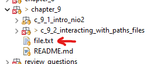
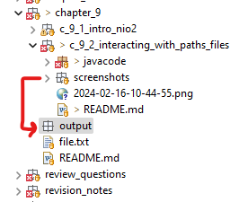

<link href="../../styles.css" rel="stylesheet"></link>


# 🧠 9.2 Interacting with Paths and Files

* A Path object does not necessarily point to a file but instead represents a location in the file system
* Some methods require for the file to exist, e.g. `Path.toRealPath()`, and will throw a checked exception if thhe file is not available.

## 🟥 9.2.1 Providing Optional Arguments
* I am not required to memorize which of the NIO.2 methods have optional arguments but I do need to know what they do
* Here are the common optional arguments in NIO.2:
  
| Enum Value | Description | Usage       |
| ---------- | ---------------------- | ----------- |
| NOFOLLOW_LINKS | Symbolic links will NOT be traversed. | Copying/moving/reading files and test for existence |
| FOLLOW_LINKS | Symbolic links WILL be traversed | Traversing a directory tree |
| COPY_ATTRIBUTES | Metadata for a file will be copied with file copied | Copy file |
| REPLACE_EXISTING | Will replace if the target file exists. If not provided will throw exception when attempting to replace existing file | Copying/Moving files |
| ATOMIC_MOVE | File is moved atomically, ensuring any process using the file sees the complete record. Throws exception if OS does not support it | Moving files |

<hr>

## 🟥 9.2.2 Using Path Objects
* Many of the methods in the Path interface transform the path object and return a new path object
* Methods are often chained, e.g.:
```java
Paths.get("/zoo/../home").getParent().normalize().toAbsolutePath();
```

### ⭐ Viewing the Path with toString(), getNameCount(), and getName() ⭐
* `String toString()` - returns a String representation of the path
```java
Path path = Paths.get("src/chapter_9/c_9_1_intro_nio2/javacode/file.txt");
System.out.println(path.toString());
```
* `int Path.getNameCount()` - returns number of elements in path
* `Path getName(int)` - returns an element of the path using an index beginning at 0:
```java
Path path = Paths.get("src/chapter_9/c_9_1_intro_nio2/javacode/file.txt");
for(int index=0;index<path.getNameCount();index++) {
  System.out.println(paths.getName(index));
}
/* prints 
src
chapter_9
...
*/
```
* If the path has a root of `/`, this will be ignored:
```java
Path pathWithRoot = Paths.get("/root/file.txt");
pathWithRoot.getName(0); // root
pathWithRoot.getName(1); // file.txt
```

### ⭐ Accessing Path Components with getFileName(), getParent(), and getRoot() ⭐
* `Path getFileName()` - returns the element furthest away from root:
```java
Path pathWithRoot = Paths.get("/root/file.txt");
pathWithRoot.getFileName(); // file.txt
```
* `Path getParent()` - returns parent element or null if not available
```java
Path path = Paths.get("/root/file.txt");
Path parentPath = path.getParent(); // root
parentPath.getParent(); // null
```
* This method will not traverse to outside the file-system!!!
```java
Path path = Paths.get("src/chapter_9/c_9_1_intro_nio2/javacode/file.txt");
path.get(0).getParent(); // null
```

* `Path getRoot()` - returns the root element for a Path object, will return null for a relative path:
```java
Path relativePath = Paths
  .get("src/chapter_9/c_9_1_intro_nio2/javacode/file.txt");
relativePath.getRoot(); // null
		
 Path pathWithRoot = Paths
  .get("/root/file.txt");
pathWithRoot.getRoot(); // \
		
Path fullPath = Paths
  .get("C:\\Users\\Shiv\\Documents\\GitHub");
fullPath.getRoot(); // C:\
```

<br>

* Here is a program which traverses absolute and relative path objects to show how it handles the root differently
```java
public class PathFilePathTest {
  static void printPathInformation(Path path) {
    System.out.println("Filename is: "+path.getFileName());
    System.out.println("Root is: "+path.getRoot());

    Path currentPath = path;
    while((currentPath = currentPath.getParent()) != null) {
      System.out.println("  Current parent is: "+currentPath);
    }
  }
}
```
* Here we print a relative and absolute path:
```java
// MAIN METHOD:
Path relativePath = Paths
	.get("src/chapter_9/c_9_1_intro_nio2/javacode/file.txt");
printInformation(relativePath);
/* Filename is: file.txt
  * Root is: null
  *   Current parent is: src\chapter_9\c_9_1_intro_nio2\javacode
  *   Current parent is: src\chapter_9\c_9_1_intro_nio2
  *   Current parent is: src\chapter_9
  *   Current parent is: src
*/

Path absolutePath = Paths.get("C:\\Users\\Shiv\\Documents\\GitHub");
printInformation(absolutePath);
/* Filename is: Github
  * Root is: C:\
  *   Current parent is: C:\Users\Shiv\Documents
  *   Current parent is: C:\Users\Shiv
  *   Current parent is: C:\Users
  *   Current parent is: C:\
*/
```

### ⭐ Checking Path Type with isAbsolute() and toAbsolutePath() ⭐
* `boolean isAbsolute()` - checks if path is absolute or relative
* `Path toAbsolute(Path)` - converts a relative path to an absolute path or returns a copy if an absolute path is provided
```java
Path relativePath = Paths
      .get("src/chapter_9/c_9_1_intro_nio2/javacode/file.txt");
relativePath.isAbsolute(); // false
Path relativeToAbsolute = relativePath.toAbsolutePath();
System.out.println(relativeToAbsolute);
/* C:\Users\Shiv\Documents\GitHub\
  *  OCP-Java-Examples\src\chapter_9\
  *  c_9_1_intro_nio2\javacode\file.txt */

Path absolutePath = Paths
    .get("C:\\Users\\Shiv\\Documents\\GitHub");
absolutePath.isAbsolute(); // true
Path absoluteToAbsolutePath = absolutePath.toAbsolutePath();
absoluteToAbsolutePath;
// C:\Users\Shiv\Documents\GitHub
```

### ⭐ Creating a New Path with subpath() ⭐
* `Path subpath(int, int)` - returns a relative path where the second parameter is exclusive of the elements
```java
Path absolutePath = Paths
  .get("\\Users\\Shiv\\Documents\\GitHub")
absolutePath.getNameCount(); // 4
absolutePath.subpath(1,1); // throws exception
absolutePath.subpath(0,1); // Users
absolutePath.subpath(0,4); // Users/Shiv/Documents/GitHub
```

### ⭐ Using Path Symbols ⭐
* We can use `.` for current directory and `..` for directory of parent of current directory
```java
Path parentPathOfGitHub = Paths
				.get("\\Users\\Shiv\\Documents\\GitHub\\..");
parentPathOfGitHub.normalize(); // \Users\Shiv\Documents
```

### ⭐ Deriving a Path with relativize() ⭐
* `Path relativize(Path anotherPath)` - returns a path to get to `anotherPath`
* Here is an example using two absolute paths:
```java
Path absolutePath1 = Paths
  .get("/Documents/pizza.txt");
Path absolutePath2 = Paths
  .get("Documents/Shiv/file.txt");
absolutePath1.relativize(absolutePath2);
// ../Shiv/file.txt
absolutePath2.relativize(absolutePath1);
// ../../pizza.txt
```
* If two relative paths are provided, they are computed as if they are in the same working directory:
```java
Path relPath1 = Paths
  .get("pizza.txt");
Path relPath2 = Paths
  .get("poultry/chicken.txt");
relPath1.relativize(relPath2); // ../poultry/chicken.txt
relPath2.relativize(relPath1); // ../../pizza.txt
```
* If you try to mix a relative and absolute path, you will get an `IllegalArgumentException` at runtime:
```java
relPath1.relativize(absolutePath1); // THROWS EXCEPTION
absolutePath1.relativize(relPath1); // THROWS EXCEPTION
```

### ⭐ Joining Path Objects with resolve() ⭐
* `Path resolve(Path other)` - appends the other path to path it was invoked on.
```java
Path path1 = Paths.get("/cats/../panther");
Path path2 = Paths.get("/food");
path1.resolve(path2); // \food
path2.resolve(path1); // \cats\..\panther
```

### ⭐ Cleaning Up a Path with normalize() ⭐
* The `Path normalize()` method is used to clean up redundancies in paths which use `..`
```java
Path path1 = Paths.get("/cats/../panther");
Path path2 = Paths.get("/food");

path2.resolve(path1); // cats/../panther
path2.resolve(path1).normalize(); // /panther
```

### ⭐ Checking for File Existence with toRealPath() ⭐
* This method has the following signature:
```java
Path toRealPath(LinkOption... options) throws IOException;
```
* It will give the complete path of a relative or absolute path which EXISTS:
```java
Path relativePath = Paths
  .get("src/chapter_9/c_9_1_intro_nio2/javacode/file.txt");
Path absolutePath = Paths
  .get("C:\\Users\\Shiv\\Documents\\GitHub");
try {
  relativePath.toRealPath();
  /*
   * C:\Users\Shiv\Documents
   * \GitHub\OCP-Java-Examples
   * \src\chapter_9\c_9_1_intro_nio2
   * \javacode\file.txt
  */

  absolutePath.toRealPath();
  /*
   * C:\Users\Shiv\Documents\GitHub
  */
} catch (IOException e) {
  // no exceptions thrown
}
```
* This method throws `IOException` if the path does not point to real file/directory:
```java
Path fakePath = Paths.get("file-does-not-exist.txt");
try {
  System.out.println(fakePath.toRealPath());
} catch (IOException e) {
  System.out.println("path does not exist");
  // prints the above!
}
```

<hr>

## 🟥 9.2.3 Interacting With Files
* We can use Path objects to interact with files! Many of the methods within `java.io.File` have a wrapper method in `java.nio.file.Path` via a helper class `java.nio.file.Files` which operate on Paths and not Files!!!
* The `Files` helper class has static methods which take one or two Path objects


### ⭐ Testing Path with exists() ⭐
* `boolean Files.exists(Path)` returns true if and only if the referenced path exists in file system
```java
Path relativePathOfFile = Paths
  .get("src/chapter_9/c_9_1_intro_nio2/javacode/file.txt");
Files.exists(relativePathOfFile); // true

Path relativePathOfFolder = Paths
  .get("src/chapter_9/c_9_1_intro_nio2/javacode/");
Files.exists(relativePathOfFolder); // true

Path fakeRelativePath = Paths
    .get("src/fake");
Files.exists(fakeRelativePath); // true
```

### ⭐ Testing Uniqueness with isSameFile() ⭐
* This method has the following signature:
```java
boolean isSameFile(Path,Path) throws IOExcetpion
```
* Returns true if both paths are equal in terms of `equal()`. If provided a non-existent file, then IOException is thrown
* Here are some examples:
```java
Path relRealPath = Paths
  .get("src/chapter_9/c_9_2_interacting_with_paths_files/javacode/file.txt");
Path absoluteRealPath = Paths
  .get("C:\\Users\\shiv.kumar\\Documents\\Github\\OCP-Java-Examples\\src\\chapter_9\\c_9_2_interacting_with_paths_files\\javacode\\file.txt");
try {
  Files.isSame(relRealPath, absoluteRealPath); // true!!!
} catch (IOException e) {}


try {
  Path relFakePath = Paths.get("fake");
  Files.isSameFile(relRealPath, relFakePath);
} catch (IOException e) {
  // exception is caught!
}
```

### ⭐ Using createDirectory() and createDirectories() ⭐
* These methods will throw an IOException if directory cannot be created(e.g. already exists); otherwise it returns the Path of the director
* Example of `Files.createDirectory()`:
```java
Path dirWhichAlreadyExists = Paths
  .get("src/chapter_9/" + "c_9_2_interacting_with_paths_files"
      + "/javacode/");
try {
  Files.createDirectory(dirWhichAlreadyExists);
  System.out.println("never reaches here");
} catch (IOException e) {
  System.out.println("Exception is caught!!!");
}
```
* Running the above did create a directory:


* Attempting to make nested directories with `createDirectory()` will throw an exception:
```java
try {
  Files.createDirectory(nestedDirectories);
  System.out.println("Never reached");
} catch (IOException e) {
  System.out.println("Exception is caught!!!");
}
```

### ⭐ Duplicating File Contents with copy() ⭐
* This method has the following signature:
```java
Path copy(Path source, Path target) throws IOException
```
* Here is an example of copying a file:
```java
Path sourceFilePath = Paths
    .get("src//chapter_9//c_9_2_interacting_with_paths_files//javacode//file.txt");
Path targetFilePath = Paths
  .get("src//chapter_9//file.txt");
try {
  Files.copy(sourceFilePath, targetFilePath);
} catch (IOException e) { /* handle */ }
```


* This method takes SHALLOW copies of files⚠️
* Here is an example of attempting to take a copy of my screenshots folder:
```java
Path screenshotsFolder = Paths
	.get("src//chapter_9//c_9_2_interacting_with_paths_files//screenshots");
Path targetFilePath = Paths
  .get("src//chapter_9//output");
try {
  Files.copy(sourceFilePath, targetFilePath);
} catch (IOException e) { /* handle */ }
```

<br>

* The `copy()` method can be overloaded with CopyOptions:
  - `NOFOLLOW_LINKS`
  - `REPLACE_EXISTING`
  - `COPY_ATTRIBUTES`

#### 🌱 Copying Files with java.io and NIO.2 🌱
* NIO.2 Files class has two overloads of the copy method:
  - `copy(InputStream source, Path target)`
  - `copy(Path source, OutputStream target)`
* Here is an example of both methods:
```java
try (InputStream inputStr = new FileInputStream("source-data.txt");
     OutputStream outputStr = new FileOutputStream("output-data.txt")) {
  Files.copy(inputStr, Paths.get("C:\\mammals\\file.txt"));
  Files.copy(Paths.get("C:\\fish\\file.txt"), outputStr);
} catch (IOException e) {}
```

### ⭐ Changing File Location with move() ⭐
* Method signature:
```java
Path move(Path source, Path destination) throws IOException
```
* This method will throw IOException if the file can not be found or cannot be moved
### ⭐ Using delete() and deleteIfExists() ⭐

### ⭐ Reading and Writing using newBufferedReader() and newBufferedWriter() ⭐


### ⭐ Reading Files with readAllLines() ⭐

