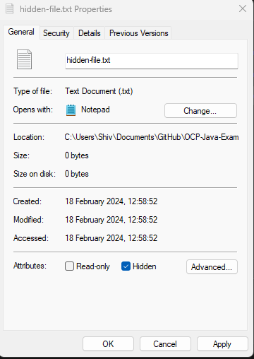

<link href="../../styles.css" rel="stylesheet"></link>


# 🧠 9.3 Understanding File Attributes
* File attributes are metadata of files and directories - which is not stored in the contents of the file but rather the file system
* Files class has methods for accessing file attributes

<hr>

## 🟥 9.3.1 Discovering Basic File Attributes
* We shall discuss methods DIRECTLY WITHIN the Files class for reading file attributes
* These methods can be used in ANY operating system but may have limited information in some systems.

### ⭐ Reading Common Attributes with isDirectory(), isRegularFile(), and isSymbolicLink() ⭐
* These methods all take a Path and return a `boolean` 
* `Files.isRegularFile(Path)` is true if path points to a regular file (any non-directory, non-symbolic link, non-resource or any non-regular file)
* `Files.isDirectory(Path)` is true if path points to directory
* `Files.isSymbolicLink(Path)` is true if path is a symbolic link
```java
Path directory = Paths
    .get("src//chapter_9");
Files.isRegularFile(directory); // false
Files.isDirectory(directory); // true
Files.isSymbolicLink(directory); // false

Path file = Paths
    .get("src//chapter_9//README.md");
Files.isRegularFile(file); // true
Files.isDirectory(file); // false
Files.isSymbolicLink(file); // false

Path symbolicLink = Paths
    .get("src//symbolic-link"); // just a placeholder
Files.isRegularFile(symbolicLink);
// ^ COULD be true if points to regular file
Files.isDirectory(symbolicLink);
// ^ COULD be true if points to directory
Files.isSymbolicLink(symbolicLink); // true
```

### ⭐ Checking File Visibility with isHidden() ⭐
* Method signature:
```java
boolean isHidden(Path) throws IOException
```
* This method can throw a `NoSuchFileException` for example

* In linux based systems, hidden files are denoted by the filename - starting with a `.` makes it hidden
* In windows systems, you have to set a hidden attribute.
* I create a hidden file:



```java
Path hiddenFile = Paths.get("src//"
    + "chapter_9//"
    + "c_9_3_understanding_file_attributes//"
    + "java//"
    + "c_9_3_1//"
    + "hidden-file.txt");
try {
    boolean x = Files.isHidden(hiddenFile);
    System.out.println(x); // prints true
} catch (IOException e) { }
```

### ⭐ Testing File Accessibility with isReadable() and isExecutable() ⭐
* These methods do not throw a checked exception!
* A file could be visibile to a user but not actually readable/executable
* A file's extension does not determine if it is executable, a PNG or txt can both be executable
```java
Path file = Paths
        .get("src//"
            + "chapter_9//"
            + "c_9_3_understanding_file_attributes//"
            + "java//"
            + "c_9_3_1//"
            + "hidden-file.txt");
Files.isReadable(file); // true
Files.isExecutable(file); // true
```

### ⭐ Reading File Length with size() ⭐
* Signature:
```java
long size(Path) throws IOException
```
* This method will throw a IOException if the file does not exist or the file information can not be accessed.
```java
Path file = Paths
    .get("src//"
        + "chapter_9//"
        + "c_9_3_understanding_file_attributes//"
        + "java//"
        + "c_9_3_1//"
        + "ReadingFileLength.java");
try {
    long size = Files.size(file);
    System.out.println(size); // 845
} catch (IOException e) { }
```

### ⭐ Managing File Modifications with getLastModifiedTime() and setLastModifiedTime() ⭐
* Method signatures:
```java
FileTime getLastModifiedTime(Path) throws IOException
Path setLastModifiedTime(Path, FileTime) throws IOException
```
* Majority of OS's support the ability to track the last modified date of a file
* This can be used by applications to distinguish when a file needs processing when its contents have been modified - this is more efficient than loading the entire file!
* Example:
```java
Path file = Paths
        .get("src//"
            + "chapter_9//"
            + "c_9_3_understanding_file_attributes//"
            + "java//"
            + "c_9_3_1//"
            + "ReadingFileLength.java");
try {
    FileTime fileTime = Files.getLastModifiedTime(file);
    // ^ 2024-02-18T14:49:56.173496Z
    long epochTime = fileTime.toMillis(); 
    // ^ 1708267796173
} catch (IOException e) { }

try {
    FileTime fileTimeNow =
        FileTime.fromMillis(System.currentTimeMillis());
    // ^ 2024-02-18T15:01:47.891Z
    Files.setLastModifiedTime(file, fileTimeNow);
    Files.getLastModifiedTime(file); // 2024-02-18T15:01:47.891Z
} catch (IOException e) { }
```

### ⭐ Managing Ownership with getOwner() and setOwner() ⭐
* Method signatures:
```java
UserPrincipal getOwner(Path) throws IOException
Path setOwner(Path,UserPrincipal) throws IOException
```
* The `UserPrincipalLookupService` can be used to find a UserPrincipal record in the filesystem. This service can be obtained statically as shown:
```java
try {
    UserPrincipalLookupService lookupService
        = FileSystems.getDefault()
            .getUserPrincipalLookupService();
    UserPrincipal me = lookupService
        .lookupPrincipalByName("Shiv");
    // ^ DESKTOP-RSM8H8J\Shiv (User)
}
```
* Example of getting the PrincipalUser:
```java
Path file = Paths.get("src//"
    + "chapter_9//"
    + "c_9_3_understanding_file_attributes//"
    + "java//"
    + "c_9_3_1//"
    + "hidden-file.txt");
try {
    UserPrincipal owner = Files.getOwner(file);
    // ^ DESKTOP-RSM8H8J\Shiv (User)
}
```
<hr>

## 🟥 9.3.2 Improving Access With Views

### ⭐ Understanding Views ⭐

### ⭐ Reading Attributes ⭐

### ⭐ Modifying Attributes ⭐
