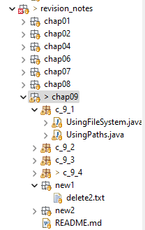

<link href="../../styles.css" rel="stylesheet"></link>

# 2️⃣ Chapter 9 - NIO.2 - Revision Notes ✍️

## 🟥 9.1 NIO.2 and Paths
### ⭐ Using Path.get() ⭐
* Path is an object used to represent a file/directory which may or MAY NOT actually be in the file system
* The main a Path instance is obtained is via `Paths.get(String)` and `Paths.get(URI)`
* Using `Paths.get(String)` we can specify either a absolute or relative path
```java
Path relativePath = Paths.get("src/chapter_9");
Path absolutePath = Paths.get("/home/zoo");
Path windowsAbsolutePath = Paths
	.get("C:\\Users\\Shiv\\Documents\\"
	+ "GitHub\\OCP-Java-Examples\\"
	+ "src\\chapter_9");
```
* You can also use this version if you do not want to specify the OS-dependent path seperator:
```java
Path relativePath = Paths.get("src","chapter_9");
Path absolutePath = Paths.get("/","home","zoo");
Path windowsAbsolutePath = Paths
	.get("C:","Users","Shiv","Documents",
		 "Github","OCP-Java-Examples",
		 "src","chapter_9");
```
* Here is an example of using `Paths.get(URI)`:
```java
URI badUri = new URI("file://src/chapter_9"); // CANT USE REL PATH
Path invalidUriPath = Paths.get(badUri); // throws runtime exception

URI validUri = new URI("file:///C:/Users");
Path validUriPath = new Path(validUri);

URI websiteUri = new URI("http://wiley.com");
Path webPath = new Path(websiteUri);
```
* Using URI, you must handle `URISyntaxException` ⚠️
```java
URI uri = null;
try {
	uri = new URI("hello");
} catch (URISyntaxException e) {}
Path uriPath = Paths.get(uri);
```

### ⭐ Using FileSystem ⭐
* You can obtain a Path via a FileSystem instance:
```java
FileSystem defaultFS = FileSystems.getDefault();
Path relPath = defaultFS.getPath("src/chapter_9");
Path absolutePath = defaultFS.getPath("/home/zoo");
Path windowsAbsolutePath = defaultFS
	.getPath("C:\\Users\\Shiv\\Documents\\"
	+ "GitHub\\OCP-Java-Examples\\"
	+ "src\\chapter_9");
```
* You can also obtain a remote file system:
```java
FileSystem remoteFS = FileSystems.getFileSystem(
	new URI("http://www.selikoff.net"));
```

### ⭐ Converting Path and File ⭐
* A File instance can be converted to a Path via `.toPath()`, a Path instance can be converted to a File via `.toFile()`:
```java
File file = new File("pandas/polar.txt");
Path fileToPath = file.toPath();

Path path = Paths.get("pandas/polar.txt");
File pathToFile = path.toFile();
```


<hr>

## 🟥 9.2 Interacting with Paths and Files
### ⭐ Common Optional Arguments ⭐
* Many methods within the NIO.2 API which interact with actual files and directories take additional option flags.
* Here are the common optional arguments:
1) `NOFOLLOW_LINKS` - symbolic links encountered will NOT be traversed.
2) `FOLLOW_LINKS` - symbolic links WILL be traversed
3) `COPY_ATTRIBUTES` - all metadata of the file being copied, will be copied with it
4) `REPLACE_EXISTING` - if the target files exist, it will be replaced. If not provided, and the target file already exists then an exception will be thrown
5) `ATOMIC_MOVE` - will ensure any prcoess will never see an incomplete record. Will throw an exception if not supported by thhe file systen
* The options can be accessed via the enum `StandardCopyOption`

<br>

### ⭐ Path Object Methods ⭐
#### 🌱 Name Methods 🌱
* These methods are on the `Path` interface:
1. `String toString()` - converts the Path to a String, i.e. it will return the String which is passed into the `Paths.get(String)`
```java
Paths.get("./").toString(); // .
Paths.get("/.").toString(); // /.
Paths.get("src/../").toString(); // src/..
Paths.get("/home/zoo").toString(); // /home/zoo
```
2) `int getNameCount()` - returns number of names of the path
3) `Path getName(int)` - returns the name component of a path (zero-indexed)
```java
Path path1 = Paths.get("./");
Path absolutePath = Paths.get("/home/zoo");
path1.getNameCount(); // 1
path1.getName(0); // .
path1.getName(1); // THROWS EXCEPTION
absolutePath.getNameCount(); // 2
absolutePath.getName(0); // home
absolutePath.getName(1); // zoo
```


#### 🌱 Path Component Methods 🌱
1. `Path getFileName()` - returns Path furthest away from the LHS
```java
Path absolutePath = Paths.get("home/zoo");
absolutePath.getFileName(); // zoo
Path relPath = Paths.get("src/main/chap9/file.txt");
relPath.getFileName(); // file.txt
```

2) `Path getParent()` - returns parent path of a given path. I.e. everything to the left of the last name of the path. Will return null if a relative path is given with no enclosing directories
```java
Paths.get("relative-file.txt").getParent(); 
// null as it can not go outside the file system
Paths.get("/home/zoo/java/folder").getParent();
// /home/zoo/java
Paths.get("src/folder1/../folder2").getParent();
// src/folder1/.. 
// there is no awareness of what the path actually represents
Paths.get("src/folder1/../../../../..").getParent();
// src/folder1/../../../..
```

3) `Path getRoot()` - returns root of a path (furthest to left), null if given relative path
```java
Paths.get("relative").getRoot(); 
// null - ALWAYS for relative paths
Paths.get("/src/folder/random").getRoot();
// /
```

#### 🌱 Using isAbsolute() and toAbsolutePath() 🌱
* `boolean isAbsolute()` - true is path is absolute, regardless of whether the path actually exists
```java
Path fakeRelPath = Paths.get("fake/madeup");
fakeRelPath.isAbsolute(); // FALSE
Path fakeAbsPath = Paths.get("/home/zoo");
fakeAbsPath.isAbsolute(); // TRUE
```
* NOTE: there is NO `isRelative()` method!!!

* `Path toAbsolutePath()` - converts a relative path to an absolute path by appending the relative path to current directory. Will return same path, if path is already absolute. If an absolute path does not exist, it will append to the root directory
```java
Path fakeRelPath = Paths.get("fake/madeup");
fakeRelPath.toAbsolutePath();
//  C:\Users\Shiv\Documents\GitHub\OCP-Java-Examples\src\chapter_9

Path realAbsPath = Paths
	.get("C:/Users/Shiv/Documents/"
	   + "GitHub/OCP-Java-Examples/src/"
       + "chapter_9");
realAbsPath.toAbsolutePath();
// returns given path^

Path fakeAbsPath = Paths.get("/home/zoo");
fakeAbsPath.toAbsolutePath();
// C:\User\home\zoo
```
#### 🌱 Using subpath() 🌱
* `Path subpath(int,int)` returns a relative path of another path (either relative or absolute). It will throw an IllegalArgumentException for the following cases:
  * Start index is same as end index
  * Start index is more than end index
  * index exceeds the name count
* The end index is EXCLUSIVE⚠️
```java
Path path = Paths.get("/mammal/carnivore/racoon.image");
path.getNameCount(); // 3
path.getName(0); // mammal
path.getName(2); // racoon.image
path.subpath(0,3); // mammal/carnivore/racoon.image
path.subpath(1,2); // carnivore
path.subpath(1,1); // THROWS EXCEPTION
```

#### 🌱 Using relativize() 🌱
* `Path relative(Path other)` let's you construct a relative path between two paths. The argument path must be the same type (absolute or relative) to the one its being called on⚠️
```java
Path relPath1 = Paths.get("pizza.txt");
Path absPath1 = Paths.get("/food/pizza.txt");
Path relPath2 = Paths.get("jeans.png");
Path absPath2 = Paths.get("/clothes/jeans.png");

relPath1.relativize(absPath1); // THROWS EXCEPTION
// ^^^ types are incompatible

relPath1.relativize(relPath1); // BLANK
// ^^^ recognises paths are the same

relPath1.relativize(relPath2); 
// ../jeans.png

absPath1.relativize(absPath2);
// ../../clothes/jeans/png
```

#### 🌱 Using resolve() 🌱
* The `Path resole(Path other)` simply appends the relative path (argument) to the path it is called on (can be either relative or absolute).
* If the argument is absolute, then the argument is returned⚠️
```java
Path relPath1 = Paths.get("pizza.txt");
Path absPath1 = Paths.get("/food/pizza.txt");
Path relPath2 = Paths.get("jeans.png");

relPath1.resolve(relPath2);
// pizza.txt/jean.png
relPath1.resolve(absPath1);
// /food/pizza.txt
absPath1.resolve(relPath1);
// /food/pizza.txt/pizza.txt
```

#### 🌱 Using normalize() 🌱
* `Path normalize()` eliminates redudancies of a given path. If called on a relative Path it will return a relative path as it has no awareness beyond the file system
* This method does not check if the file actually exists
```java
Path relPath = Paths.get("home/../../..");
relPath.normalize(); // ../..
Path relPath2 = Paths.get("home/..");
relPath2.normalize(); // BLANK

Path absPath = Paths.get("/home/../home");
absPath.normalize(); // /home
Path absPath2 = Paths.get("/home/../../..");
absPath2.normalize(); // /
```

#### 🌱 Using toRealPath() 🌱
* `toRealPath()` - takes a relative path to an absolute one. If a real file does not exist, then a checked `IOException` is thrown
* This method supports `NOFOLLOW_LINKS` option
* This method IMPLICITLY calls `normalize()`💡
```java
Path nonExistentAbsPath = Paths.get("/home/zoo");
try {
	nonExistentAbsPath.toRealPath();
} catch (IOException e) {
	// EXCEPTION CAUGHT
}

Path nonExistentRelPath = Paths.get("fake");s
try {
	nonExistentRelPath.toRealPath();
} catch (IOException e) {
	// EXCEPTION CAUGHT
}

// this method CAN go beyond file system:
Path currentDir = Paths.get(".");
Path outsideCurrentDir = Paths.get("./..");
try {
	System.out.println(currentDir.toRealPath());
	// C:/Users/Shiv/Documents/GitHub/OCP-Java-Examples
	System.out.println(outsideCurrentDir.toRealPath());
	// C:/Users/Shiv/Documents/GitHub
}
```


<br>

### ⭐ Files Path Methods ⭐
* `Files` is the helper class for the `Path` interface
* Most of the methods in `Files` WILL throw an exception if the path does not exist!!⚠️

#### 🌱 Using Files.exists() 🌱
* This method is true only if the file exists in file system
* Will NOT throw any exception if file does not exist:
```java
Path existentRelPath = Paths.get("src/chapter_9");
Files.exists(existentRelPath); // TRUE
Path existentAbsPath = Paths.get("C:/Users/Shiv/Documents/GitHub");
Files.exists(existentAbsPath); // TRUE
Path nonExistentRelPath = Paths.get("fake/madeup");
Files.exists(nonExistentRelPath); // FALSE
Pathh nonExistentAbsPath = Paths.get("/home/zoo");
Files.exists(nonExistentAbsPath); // FALSE
```

#### 🌱 Using Files.isSameFile() 🌱
* The `Files.isSameFile(Path,Path)` will follow symbolic links
* The method checks if the Paths are equal under `equals()`, if so it will return true. 
* If `equals()` returns false, then it will check if the files actually exist to see
* This method will return false if the two paths are different even if the files have the same content and metadata⚠️
```java
Path realRelativePath = Paths.get("src");
Path realAbsolutePath = Paths.get("C:/Users/Shiv/Documents/GitHub/OCP-Java-Examples/src");
realRelativePath.equals(realAbsolutePath); // FALSE
realRelativePath.isSameFile(realAbsolutePath); // TRUE

// Here are two fake paths:
Path fakeAbsolutePath = Paths.get("/home/zoo");
Path fakeAbsolutePath2 = Paths.get("/home/zoo/");
fakeAbsolutePath.equals(fakeAbsolutePath2);
// TRUE
Files.isSameFile(fakeAbsolutePath, fakeAbsolutePath2);
// TRUE

// two fake paths which are equal in terms of normalize:
Path path1 = Paths.get("/home/zoo/../zoo");
Path path2 = Paths.get("/home/zoo");
path1.equals(path2); // FALSE
path1.normalize().equals(path2.normalize()); // TRUE
File.isSameFile(path1,path2); // THROWS EXCEPTION
```

#### 🌱 Using Files.createDirectory() and createDirectories() 🌱
* These methods are equivalent to `file.mkdir()` and `file.mkdirs()`.
* These methods return the path which is being created!
* This method will throw an exception e.g. if the folder already exists!
* You CAN create a folder with an extension:
```java
try {
	Path thisFolder = Paths.get("src/revision_notes/chap09");
	Path newFolder = thisFolder.resolve(Paths.get("new_folder"));
	Path createdPath = Files.createDirectory(newFolder);
	System.out.println(createdPath);
	// src\revision_notes\chap09\new_folder

	Path newFolderWithExtension = thisFolder.resolve(Paths.get("new.txt"));
	Path createdPath2 = Files.createDirectory(newFolderWithExtension);
	System.out.println(createdPath2);
	// src\revision_notes\chap09\new.txt
} catch (IOException e) { }
```
* Trying to run the above code twice will throw an exception!

#### 🌱 Using Files.copy() 🌱
* This method takes a shallow copy of a file/directory!
* This method WILL traverse symbolic links and will NOT copy attributes.
* These behaviours can be overidden using the following options:
  * `REPLACE_EXISTING`
  * `COPY_ATTRIBUTES`
  * `NOFOLLOW_LINKS`
```java
Path readMeFile = Paths
	.get("src/revision_notes/README.md");
Path targetFile = Paths
	.get("src/revision_notes/chap09/new_folder/README.md");
try {
	Path copiedPath = Files
			.copy(readMeFile, targetFile);
	System.out.println("copy: "+copiedPath);
} catch (IOException e) {
	System.out.println("exception caught");
}
```
* Running the above code TWICE will throw an exception

#### 🌱 Using Files.copy() with Java IO 🌱
* The `Files` class has two additional overloads:
```java
Path copy(IntputStream, Path)
Path copy(Path, OutputStream)
```
* Here is an example
```java
String location = System.getProperty("user.dir")
	+ "/src/revision_notes/chap09/README.md";
try (InputStream is = new FileInputStream(location)) {
	Path destination =
	   Paths.get("src/revision_notes/chap09/c_9_1/copied.md");
	long copied = Files.copy(is, destination);
	// 1442
} catch (IOException e) {}
```

#### 🌱 Using Files.move() 🌱
* By default, this method will move/rename a file and:
  * Throw an exception if target already exists
  * No perform the move attomically
  * Follow symbolic links
* This behahviour can be overridden with the following options:
  * `NOFOLLOW_LINKS`
  * `REPLACE_EXISTING`
  * `ATOMIC_MOVE` - will throw exception if not supported
* Example
```java
try {
	Path source = Paths.get("src/revision_notes/chap09/new1/file.txt");
	Path destination = Paths.get("src/revision_notes/chap09/new2/file.txt");
	Path movedFile = Files.move(source, destination);
	System.out.println(movedFile);
	// src\revision_notes\chap09\new2\file.txt
} catch (IOException e) {
	System.out.println("exception");
}
```

#### 🌱 Using Files.delete() and deleteIfExists() 🌱
* `void Files.delete(Path)` delete a file or empty directory. It will throw an exception if the file doesn't exist or the directory is not empty
```java
Path p1 = Paths
	.get("src/revision_notes/chap09/new1/delete1.txt");
try {
	Files.delete(p1);
	System.out.println("file deleted");
} catch (IOException e) {
	System.out.println("exception");
}
```
* `boolean deleteIfExists(Path)` returns whether the file has been deleted or not:
```java
Path p1 = Paths
	.get("src/revision_notes/chap09/new1/delete1.txt");
try {
	boolean deleted = Files.deleteIfExists(p1);
	System.out.println(deleted); // FALSE
} catch (IOException e) {
	System.out.println("exception");
}
```
#### 🌱 Using Files.newBufferedReader() and newBufferedWriter() 🌱
* The Files class also allows us to construct BufferedReaders and BufferedWriters using `Files.newBufferedReader(Path,Charset)`
```java
Path path = Paths.get("/animals/gopher.txt");
try (BufferedReader reader = Files.newBufferedReader(path,
			Charset.forName("US-ASCII"))) {
	// read from stream
} catch (IOException e) {}
```

#### 🌱 Using Files.readAllLines() 🌱
* You can use `List<String> readAllLines(Path)` to obtain all lines of a file
* Using this method COULD lead to an `OutOfMemoryError` as all the contents will be stored in memory at once
* Example:
```java
Path chap9RevNotes = Paths.get("src/revision_notes/chap09/README.md");
try {
	List<String> lines = Files.readAllLines(chap9RevNotes);
	lines.forEach(System.out::println);
} catch (IOException e) {
	// TODO: handle exception
}
```

<br>
<hr>

## 🟥 9.3 Understanding File Attributes
* We shall look at basic file attributes which can be obtained using the `Files` class
* We will then look at using views which can enable us to obtain file-system dependent attributes, and improve performance

### ⭐ Basic File Attributes ⭐
#### 🌱 File Type Attributes 🌱
* There are three methods defined within the Files class for determining typmende of a path. 
* All of these return a boolean and do not throw checked exception:
	- `Files.isDirectory(Path)` - true if path is a directory
	- `Files.isRegularFile(Path)` - a regular file is defined as something which is NOT a directory, resource, or symbolic link
	- `Files.isSymbolicLink(Path)`
* The first two methods COULD be true for a symbolic link, depending on the path the link is pointing too
* Example:
```java
Path thisDirectory = Paths
	.get("src/revision_notes/chap09/c_9_3");
Path thisReadMe = Paths
	.get("src/revision_notes/chap09/README.md");

Files.isDirectory(thisDirectory); // TRUE
Files.isDirectory(thisReadMe); // FALSE

Files.isRegularFile(thisDirectory); // FALSE
Files.isRegularFile(thisReadMe); // TRUE

Files.isSymbolicLink(thisDirectory); // FALSE
Files.isSymbolicLink(thisReadMe); // FALSE
```

#### 🌱 Using Files.isHidden() 🌱
* In windows, a file's visibility is determined via a property rather than metadata on the file itself
* It will throw an IOException if the file does not exist
```java
Path fake = Paths.get("fake/madeup.txt");
Path nonHidden = Paths.get("README.md");
try {
	Files.isHidden(fake);
} catch (IOException e) {
	// EXCEPTION CAUGHT!!!
}
try {
	Files.isHidden(nonHidden);
	// FALSE
} catch (IOException e) {}
```

#### 🌱 Using Files.isReadable() and isExecutable() 🌱
* `Files.isReadable()` and `Files.isExecutable()` do not throw checked exceptions
* They are used to see if a user can read the contents of a file, or run the file itself!!

#### 🌱 Using Files.size() 🌱
* This method DOES throw an exception if the file does not exist
```java
Path path = Paths.get("README");
try {
	long size = Files.size(path); // 1580
} catch (IOException e) { }
```

#### 🌱 Using Files.getLastModifiedTime() and setLastModifiedTime() 🌱
* Checking last modified time is more efficient than tracking content changes
* We can get and set the last-modified time of a file using `FileTime` which has both date and time!
```java
Path readMe = Paths.get("README.md");
try {
	FileTime fileTime = Files.getLastModifiedTime(readMe);
	// 2024-02-09T16:15:38.5052394Z
} catch (IOException e) { }

try {
	FileTime now = FileTime.fromMillis(System.currentTimeMillis());
	// 2024-02-27T09:58:35.534Z
	Path path = Files.setLastModifiedTime(readMe, now);
	// README.md
	System.out.println(Files.getLastModifiedTime(path));
	// 2024-02-27T09:58:35.534Z
} catch (IOException e) { }
```

#### 🌱 Using Files.getOwner() and setOwner() 🌱
* You can get/set the owner of a Path using:
```java
UserPrincipal getOwner(Path) throws IOException
Path setOwner(Path, UserPrincipal) throws IOException
```
* Example:
```java
Path path = Paths.get("README.md");
try {
	UserPrincipal owner = Files.getOwner(path);
	// shiv.kumar
} catch (IOException e) { }
```

* You can obtain a UserPrincipal using the `getUserPrincipalLookupService().lookupPrincipalByName(String)`
method, which throws a checkked exception:
```java
UserPrincipalLookupService lookupService
	= FileSystems.getDefault().getUserPrincipalLookupService();
try {
	UserPrincipal user = lookupService
		.lookupPrincipalByName("Shiv");
} catch (IOException e) { }
```


<br>

### ⭐ File Attributes with Views ⭐
* Rather than making singular calls to obtain multiple attributes, its more efficient to collect multiple attributes using a `View` which will lead to less round calls between Java and OS
* Views also enable use `View` classes to collect system-dependent attributes.
* The `BasicFileAttribute` class allows us to collect multiple system-independent attributes
* Views can also give us writable attributes. The `BasicFileAttributeView` lets us modify attributes

#### 🌱 Reading with Files.readAttributes() 🌱
* The `Files.readAttributes(Path,Class<A>)` returns the type specified in the second parameter
* We can pass in the `BasicFileAttributes` class which has the following methods
* This INTERFACE has the following methods:
```java
boolean isDirectory()
boolean isRegularFile()
boolean isSymbolicLink()
boolean isOther()
long size()
FileTime creationTime()
FileTime lastModifiedTime()
FileTime lastAccessTime()
Object fileKey() // null if OS does not use
```
* There are NO Setters for this class!!!

* Example:
```java
Path readMe = Paths.get("README.md");
BasicFileAttributes attributes = null;
try {
	attributes = Files.readAttributes(readMe,
		BasicFileAttributes.class);
} catch (IOException e) { }
attributes.isDirectory(); // FALSE	
attributes.isRegularFile(); // TRUE
attributes.isSymbolicLink(); // FALSE
attributes.isOther(); // FALSE
long size = attributes.size(); // 1580
FileTime creationTime = attributes.creationTime();
// 2023-06-12T14:14:38.4431714Z
FileTime lastModifiedTime = attributes.lastModifiedTime();
// 2024-02-27T09:58:35.534Z
FileTime lastAccessTime = attributes.lastAccessTime();
// 2024-02-27T12:57:51.8700587Z
Object fileKey = attributes.fileKey();
// NULL
```

#### 🌱 Modifying with Files.getFileAttributeView() 🌱
* In order to get a View to modify attributes, we use `Files.getAttributeView(Path,Class<A>)`
* We can pass in `BasicFileAttributeView` which lets us obtain an instance of `BasicFileAttributes` using `view.readAttributes()`
* This view has exactly one setter: `view.setTimes(lastModifiedTime, lastAccessTime, creationTime)`
```java
Path path = Paths.get("README.md");
BasicFileAttributeView view = null;
try {
	view = Files.getFileAttributeView(path, BasicFileAttributeView.class);
	BasicFileAttributes attributes = view.readAttributes();

	FileTime newLastModified = FileTime.fromMillis(
		data.lastModifiedTime().toMillis());
	view.setTimes(newLastModified, null, null);
} catch (IOException e) {}
```
* You specify null in setTimes if you do not want to modify that attribute!

<br>
<hr>

## 🟥 9.4 Stream Methods
### ⭐ Walking a Directory ⭐
#### 🌱 Using Files.walk() 🌱
* `File.walk(Path)` can be overloaded an `int maxDepth` parameter, which specifies how deep the walk should be.
* The default maxDepth value is `Integer.MAX_VALUE`
* Here is the structure of the below path:

```java
Path path = Paths.get("src/revision_notes/chap09");
try {
	// this will not look into the path given:
	Stream<Path> stream = Files.walk(path);
	// src\revision_notes\chap09
} catch (IOException e) { }
```
* If I supply a maxDepth of 0, it will only look at the path itself:
```java
Files.walk(path, 0)
	.forEach(System.out::println);
/*
src/revision_notes/chap09
*/
```
* Here are the results with a maxDepth of 1:
```java
Files.walk(path,1)
	.forEach(System.out::println);
/*
src/revision_notes/chap09
src/revision_notes/chap09/README.md
src/revision_notes/chap09/c_9_1
src/revision_notes/chap09/c_9_2
src/revision_notes/chap09/c_9_3
src/revision_notes/chap09/c_9_4
src/revision_notes/chap09/new1
src/revision_notes/chap09/new2
```

#### 🌱 Using Files.find() 🌱
* The `Files.find(Path,int,BiPredicate)` is similar to the `Files.walk()` method except it let's us explicitly filter the restults. 
* The BiPredicate takes a path and attribute!
* E.g. let's find all the files 2 levels deep which have been modified after 2024:
```java
Path path = Paths
	.get("src/revision_notes/chap09/");
long twentTwentyFourMillis = 1704067260000l;
FileTime twentyTwentyFour = FileTime.fromMillis(twentTwentyFourMillis);
// 2024-01-01T00:01:00Z
try {
	BiPredicate<Path, BasicFileAttributes> biPred 
		= (p,a) -> p.toString().endsWith(".java")
			&& a.lastModifiedTime.toMillis()>twentTwentyFourMillis;
	Files.find(path, 2, biPred);
} catch (IOException e) {}
/* this prints the following:
src\revision_notes\chap09\c_9_1\UsingFileSystem.java
src\revision_notes\chap09\c_9_1\UsingPaths.java
src\revision_notes\chap09\c_9_2\NameMethods.java
src\revision_notes\chap09\c_9_2\PathComponentMethods.java
...
```
### ⭐ Using Files.list() ⭐

### ⭐ Using Files.lines() ⭐

## 🟥 9.5 Comparing Legacy Files and NIO.2 Methods
